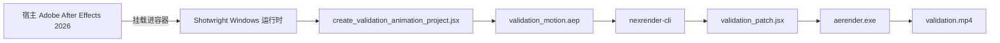

<div align="center">

# Shotwright

[English](README.md) | 简体中文

### 面向 AI 智能体的容器化 Adobe After Effects 运行时

构建 Windows 渲染工作节点，既可以挂载真实的 After Effects 安装，也可以从许可的安装缓存自动安装；同时对 nexrender 输出做端到端验证，让设计师专注创意，而不是被基础设施拖住。

<p>
	
	
	
	
	
</p>

</div>

> [!IMPORTANT]
> Shotwright 始终把 After Effects 放在工作流中心。它不是泛化的 AI 视频自动化工具，而是一套可复现、可审计的 AE 运行时基础设施：让 AI 智能体接手重复的执行动作，让设计师保留审美判断与最终控制权。

> [!NOTE]
> 本文约定如下：AI Agent 统一译为“AI 智能体”；proxy 统一译为“代理”；installer cache 统一称为“安装缓存”。

<details>
<summary><strong>目录</strong></summary>

- [验证演示](#-验证演示)
- [为什么选择 Shotwright](#-为什么选择-shotwright)
- [核心能力](#-核心能力)
- [验证流程](#-验证流程)
- [环境要求](#-环境要求)
- [快速开始](#-快速开始)
- [CI 与私有安装缓存](#-ci-与私有安装缓存)
- [项目结构](#-项目结构)
- [设计说明](#-设计说明)
- [路线图](#-路线图)

</details>

## ✨ 验证演示

<p align="center">
	<a href="./validation-data/output/validation.mp4">
		
	</a>
</p>

<p align="center">
	<a href="./validation-data/output/validation.mp4">
		
	</a>
</p>

当前冒烟测试已经能够通过 Windows 容器、宿主机挂载的 After Effects 安装与 nexrender，稳定产出真实的 mp4 文件。

| 产物 | 状态 | 说明 |
| --- | --- | --- |
| `validation.mp4` | ✅ 已提交 | 当前仓库状态下的标准冒烟测试输出 |
| `validation_motion.aep` | 🟡 本地生成 | 验证时重新生成，故意不纳入 Git，以避免不必要的二进制文件波动 |

## 🎬 为什么选择 Shotwright

多数 AI 视频产品都在缩小创作空间：更少的决定权、更少的控制面、更多的模板约束。Shotwright 选择相反的方向。

- 让 AE 设计师获得 AI 智能体带来的执行杠杆，而不必自己扛起 Windows 容器运维。
- 让验证渲染保持可复现、可回放、可审计。
- 让基础设施退到背景，把判断力和品味留给人。
- 把 After Effects 当作严肃的运行时基座，而不是面板脚本的包装壳。

## 🧰 核心能力

| 能力 | 实际含义 |
| --- | --- |
| Windows 运行时镜像 | 构建包含 Node.js、Python 3.13、ffmpeg、Git 与 nexrender 依赖的容器 |
| 宿主机挂载模式 | 直接使用宿主机上的 Adobe After Effects 2026，而不是把 AE 打包进镜像 |
| 安装缓存模式 | 从挂载进容器的许可安装缓存中安装 After Effects 26.2 |
| 验证工程生成 | 通过 JSX 生成可复现的 AEP，方便重复执行冒烟测试 |
| 仅补丁 JSX | 验证脚本只负责合成修改，渲染过程完全交由 nexrender |

## 🔄 验证流程



## 🧱 环境要求

- Windows 宿主机
- 已启用 Windows 容器模式的 Docker
- 满足以下任一条件：
	- 宿主机已安装 Adobe After Effects 2026
	- 已准备 After Effects 26.2 的许可安装缓存以及 Creative Cloud Helper 安装缓存

> [!IMPORTANT]
> Shotwright 不分发 Adobe 安装程序。请将安装缓存保存在你自己的本地存储或私有制品仓库中。

> [!TIP]
> Dockerfile 已通过 `http_proxy`、`https_proxy`、`HTTP_PROXY`、`HTTPS_PROXY` 构建参数内置代理支持。

## 🚀 快速开始

### 第 1 步 — 构建 Docker 镜像

- 做什么：生成一个预装 Node.js、Python、ffmpeg 与 nexrender 的 Windows 容器镜像。
- 结果：得到一个标签为 `shotwright:dev` 的本地 Docker 镜像。
- 能跳过吗：不能。这是后续所有步骤的基础。

```powershell
docker build -t shotwright:dev .
```

Dockerfile 默认启用 `AUTO_INSTALL_AFTER_EFFECTS=1`。容器启动时如果检测到挂载的安装缓存，就会自动安装 AE；如果没有检测到，则静默跳过。

如需显式关闭自动安装：

```powershell
docker build --build-arg AUTO_INSTALL_AFTER_EFFECTS=0 -t shotwright:dev .
```

<details>
<summary><strong>带代理的构建示例</strong></summary>

```powershell
$proxy = 'http://192.168.1.80:8080'
docker build `
	--build-arg http_proxy=$proxy `
	--build-arg https_proxy=$proxy `
	--build-arg HTTP_PROXY=$proxy `
	--build-arg HTTPS_PROXY=$proxy `
	-t shotwright:dev .
```

</details>

### 第 2 步 — 运行验证渲染（宿主机挂载模式）

- 做什么：启动容器，将宿主机上的 After Effects 2026 挂载进去，生成测试 AEP，并通过 nexrender 完成渲染。
- 结果：得到 `validation-data/output/validation.mp4`，一个 4 秒的 H.264 mp4 文件。
- 能跳过吗：如果你只关心安装缓存模式，可以直接跳到第 3 步。

```powershell
powershell -ExecutionPolicy Bypass -File .\scripts\validate\run_validation.ps1 -ImageTag shotwright:dev
```

### 第 3 步 — 运行验证渲染（安装缓存模式）

- 做什么：把许可安装缓存挂载进容器。容器先自动安装 After Effects，再执行与第 2 步相同的验证渲染。
- 结果：同样得到 `validation-data/output/validation.mp4`。
- 能跳过吗：如果第 2 步已经覆盖了你的验证场景，这一步可选。

先在宿主机准备这两个目录：

| 目录 | 内容 |
| --- | --- |
| `C:\data\payload\AEFT_26.2_win64` | `driver.xml` 以及所有 AE 安装包目录 |
| `C:\data\payload\CreativeCloudHelper_win64` | `HDBox` 和 `IPC` 目录 |

运行：

```powershell
powershell -ExecutionPolicy Bypass -File .\scripts\validate\run_validation.ps1 `
	-ImageTag shotwright:dev `
	-AfterEffectsPayloadRoot 'C:\data\payload\AEFT_26.2_win64' `
	-CreativeCloudHelperRoot 'C:\data\payload\CreativeCloudHelper_win64'
```

### 第 4 步 — 可选：从零准备安装缓存

- 做什么：通过 Adobe 公开目录下载 After Effects 26.2 的安装布局。
- 结果：得到 `C:\data\payload\AEFT_26.2_win64` 和 `C:\data\payload\CreativeCloudHelper_win64`。
- 能跳过吗：如果你已经有本地安装缓存，或者采用宿主机挂载模式，可以跳过。

```powershell
python scripts\install\download_after_effects_payload.py --payload-root C:\data\payload
```

首次使用前，需要先对辅助安装器做一次补丁：

```powershell
python scripts\install\modify_setup_win.py C:\data\payload\CreativeCloudHelper_win64\HDBox\Setup.exe
```

## 🧱 CI 与私有安装缓存

`.github/workflows/windows-container-validation.yml` 中的 GitHub Actions 工作流使用 `windows-2025` 运行器。

- `dockerfile-build` 会在 push 和 pull request 上运行，用来确认镜像仍然可以正常构建。
- `validation-render` 仅在手动触发的 `workflow_dispatch` 下运行，因为它依赖一个私有安装缓存压缩包。

该压缩包通过 `SHOTWRIGHT_INSTALLER_CACHE_URL` 密钥提供。解压后必须满足以下任一结构：

- `payload/AEFT_26.2_win64` 与 `payload/CreativeCloudHelper_win64`
- 或者直接把这两个目录放在压缩包根目录

仓库不会指向任何公开的 Adobe 安装程序下载链接。

## 📁 项目结构

```text
scripts/
	install/
		download_after_effects_payload.py       从 Adobe 目录下载 AE 安装缓存
		download_utils.py                       Adobe 目录与下载辅助工具
		install_after_effects_in_container.ps1  在容器内从安装缓存安装 AE
		modify_setup_win.py                     给 Adobe 辅助安装器 Setup.exe 打补丁
	validate/
		create_validation_animation_project.jsx  生成测试 AEP
		run_validation.ps1                      手动冒烟测试入口
		validation_nexrender_job.json           最小化 nexrender 任务定义
		validation_patch.jsx                    仅做补丁的 JSX 脚本
	runtime_entrypoint.ps1                    容器启动脚本
	pull_mcr_image.py                         通过代理拉取 MCR 基础镜像的辅助脚本

validation-data/
	output/                                   渲染输出产物
	templates/                                生成的验证 AEP 文件
	work/                                     nexrender 工作目录与日志
```

## 📝 设计说明

- Docker 镜像本身不包含 Adobe After Effects。
- 运行时既可以挂载宿主机上的 `C:\Program Files\Adobe\Adobe After Effects 2026`，也可以从挂载到 `C:\lab\payload` 的安装缓存中安装。
- 容器启动时会执行 `scripts/runtime_entrypoint.ps1`。当 `AUTO_INSTALL_AFTER_EFFECTS=1` 且检测到安装缓存目录时，会自动安装 AE；否则直接跳过。
- 验证用 JSX 只负责补丁逻辑，渲染执行与输出管理由 nexrender 统一负责。
- 验证任务通过 `outputExt: mp4` 和 `@nexrender/action-copy` 保证最终只留下一个稳定、可预期的视频产物。

## 🗺️ 路线图

- [ ] 为验证命令构建器和异常恢复路径补充集成测试。
- [ ] 支持远程工作节点池和分布式渲染调度。
- [ ] 为任意用户 AEP 上传构建可复现的任务打包流程。
- [ ] 增加产物保留与清理策略。
- [ ] 构建更高层的任务模型，把设计师意图映射到容器化执行。

## 📄 许可证

MIT
