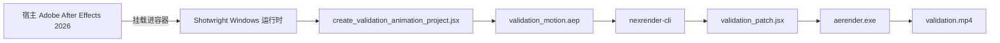

<div align="center">

# Shotwright

[English](README.md) | 简体中文

### 面向 AI 代理的容器化 Adobe After Effects 运行时

构建 Windows 渲染工作节点，挂载真实的 After Effects 安装或从许可的安装缓存自动安装，端到端验证 nexrender 输出——让设计师无需变成基础设施运维人员。

<p>
	
	
	
	
	
</p>

</div>

> [!IMPORTANT]
> Shotwright 将 After Effects 置于工作流的核心。目标不是泛化的 AI 视频自动化，而是可复现的 AE 运行时基础设施——让代理执行枯燥的部分，设计师保留品味与决策权。

## 目录

- [验证演示](#-验证演示)
- [为什么选择 Shotwright](#-为什么选择-shotwright)
- [能力概览](#-能力概览)
- [验证流程](#-验证流程)
- [环境要求](#-环境要求)
- [快速开始](#-快速开始)
- [项目结构](#-项目结构)
- [设计要点](#-设计要点)
- [路线图](#-路线图)

## ✨ 验证演示

<p align="center">
	<a href="./validation-data/output/validation.mp4">
		
	</a>
</p>

<p align="center">
	<a href="./validation-data/output/validation.mp4">
		
	</a>
</p>

当前冒烟测试通过 Windows 容器、挂载的宿主 After Effects 安装以及 nexrender 成功渲染出真实的 mp4 文件。

| 产物 | 状态 | 说明 |
| --- | --- | --- |
| `validation.mp4` | ✅ 已提交 | 当前仓库状态下的冒烟测试渲染输出 |
| `validation_motion.aep` | 🟡 本地生成 | 验证过程中重新创建，有意不纳入 Git 以避免不必要的二进制文件变动 |

## 🎬 为什么选择 Shotwright

大多数 AI 视频产品在缩小创作面：更少的决策、更少的控制、更多的模板。Shotwright 走相反的路线。

- 给 AE 设计师代理杠杆，而不是要求他们成为 Windows 容器运维人员。
- 让验证渲染可复现、可重放、易审计。
- 让基础设施消失在背景中，品味留给人类。
- 把 After Effects 当作严肃的运行时基座，而不是面板脚本的玩具包装。

## 🧰 能力概览

| 能力 | 实际含义 |
| --- | --- |
| Windows 运行时镜像 | 构建内含 Node.js、Python 3.13、ffmpeg、Git 和 nexrender 依赖的容器 |
| 宿主 AE 挂载 | 可将宿主机已安装的 Adobe After Effects 2026 挂载进容器 |
| Payload 安装模式 | 可从用户提供的许可安装缓存在容器内安装 After Effects 26.2 |
| 验证项目生成 | 通过 JSX 创建可复现的 AEP，方便重放冒烟测试 |
| 仅补丁验证脚本 | JSX 仅负责合成编辑，nexrender 负责渲染 |

## 🔄 验证流程



## 🧱 环境要求

- Windows 宿主机
- Docker 已启用 Windows 容器模式
- 以下二选一：
	- 宿主机已安装 Adobe After Effects 2026
	- 拥有 After Effects 26.2 许可安装缓存和 Creative Cloud 辅助安装包

> [!IMPORTANT]
> Shotwright 不分发 Adobe 安装程序。请将安装包保存在你自己的本地缓存或私有制品仓库中。

> [!TIP]
> Dockerfile 已通过 `http_proxy`、`https_proxy`、`HTTP_PROXY`、`HTTPS_PROXY` 构建参数内置了代理感知能力。

## 🚀 快速开始

### 第 1 步 — 构建 Docker 镜像

**做什么**：生成一个预装 Node.js、Python、ffmpeg 和 nexrender 的 Windows 容器镜像。
**结果**：本地产生标签为 `shotwright:dev` 的 Docker 镜像。
**能跳过吗**：不能。镜像是后续所有步骤的基础。

```powershell
docker build -t shotwright:dev .
```

Dockerfile 默认启用 `AUTO_INSTALL_AFTER_EFFECTS=1`：容器启动时如果检测到挂载的安装缓存，会自动安装 AE；如果没有挂载，静默跳过。

显式禁用自动安装：

```powershell
docker build --build-arg AUTO_INSTALL_AFTER_EFFECTS=0 -t shotwright:dev .
```

<details>
<summary><strong>带代理的构建示例</strong></summary>

```powershell
$proxy = 'http://192.168.1.80:8080'
docker build `
	--build-arg http_proxy=$proxy `
	--build-arg https_proxy=$proxy `
	--build-arg HTTP_PROXY=$proxy `
	--build-arg HTTPS_PROXY=$proxy `
	-t shotwright:dev .
```

</details>

### 第 2 步 — 运行验证渲染（宿主 AE 模式）

**做什么**：启动容器，将宿主机的 After Effects 2026 挂载进去，生成测试 AEP，通过 nexrender 渲染。
**结果**：`validation-data/output/validation.mp4` — 一个 4 秒的 H.264 mp4。
**能跳过吗**：如果你只想用安装缓存模式，直接跳到第 3 步。

```powershell
powershell -ExecutionPolicy Bypass -File .\scripts\validate\run_validation.ps1 -ImageTag shotwright:dev
```

### 第 3 步 — 运行验证渲染（安装缓存模式）

**做什么**：将许可安装缓存挂载进容器。容器自动安装 After Effects，然后执行与第 2 步相同的验证渲染。
**结果**：同样产出 `validation-data/output/validation.mp4`。
**能跳过吗**：如果已通过第 2 步的宿主 AE 模式验证，此步可选。

在宿主机上准备两个目录：

| 目录 | 内容 |
| --- | --- |
| `C:\data\payload\AEFT_26.2_win64` | `driver.xml` 和所有 AE 安装包文件夹 |
| `C:\data\payload\CreativeCloudHelper_win64` | `HDBox` 和 `IPC` 目录 |

运行：

```powershell
powershell -ExecutionPolicy Bypass -File .\scripts\validate\run_validation.ps1 `
	-ImageTag shotwright:dev `
	-AfterEffectsPayloadRoot 'C:\data\payload\AEFT_26.2_win64' `
	-CreativeCloudHelperRoot 'C:\data\payload\CreativeCloudHelper_win64'
```

### 第 4 步 —（可选）从零构建安装缓存

**做什么**：使用 Adobe 公开目录下载 After Effects 26.2 安装布局。仅在你还没有安装缓存目录时需要。
**结果**：`C:\data\payload\AEFT_26.2_win64` 和 `C:\data\payload\CreativeCloudHelper_win64`。
**能跳过吗**：如果你已有本地安装缓存，或使用宿主挂载模式，可以跳过。

```powershell
python scripts\install\download_after_effects_payload.py --payload-root C:\data\payload
```

首次使用前需要对辅助安装器打补丁（一次性操作）：

```powershell
python scripts\install\modify_setup_win.py C:\data\payload\CreativeCloudHelper_win64\HDBox\Setup.exe
```

## 🧱 安装缓存与 CI

`.github/workflows/windows-container-validation.yml` 中的 GitHub Actions 工作流使用 `windows-2025` 运行器，在每次 push/PR 时验证 Dockerfile 是否仍能正常构建。

完整安装+渲染路径仅在 `workflow_dispatch` 时运行，因为它需要通过 `SHOTWRIGHT_INSTALLER_CACHE_URL` 密钥提供私有安装包 zip。zip 解压后需包含：

- `payload/AEFT_26.2_win64` 和 `payload/CreativeCloudHelper_win64`
- 或直接将这两个目录放在压缩包根目录

仓库不指向任何公开的 Adobe 安装程序发布。

## 📁 项目结构

```text
scripts/
	install/
		download_after_effects_payload.py    从 Adobe 目录下载 AE 安装包
		download_utils.py                    Adobe 安装目录与下载辅助工具
		install_after_effects_in_container.ps1  从挂载的安装包在容器内安装 AE
		modify_setup_win.py                  给 Adobe 辅助安装器 Setup.exe 打补丁
	validate/
		create_validation_animation_project.jsx  生成模拟动画 AEP
		run_validation.ps1                   手动冒烟测试入口
		validation_nexrender_job.json        最小化 nexrender 任务定义
		validation_patch.jsx                 nexrender 使用的仅补丁 JSX
	runtime_entrypoint.ps1    容器启动脚本（自动安装 + 保活）
	pull_mcr_image.py         通过代理拉取 MCR 基础镜像的辅助脚本

validation-data/
	output/                   渲染验证产物
	templates/                生成的验证 AEP 文件
	work/                     nexrender 工作目录和日志
```

## 📝 设计要点

- Docker 镜像本身不包含 Adobe After Effects。
- 运行时可以从宿主挂载 `C:\Program Files\Adobe\Adobe After Effects 2026`，也可以从挂载到 `C:\lab\payload` 的安装缓存安装。
- 容器启动时运行 `scripts/runtime_entrypoint.ps1`。当 `AUTO_INSTALL_AFTER_EFFECTS=1`（默认值）且检测到安装缓存目录时，自动安装 AE；缓存不存在则静默跳过。
- 验证 JSX 设计上仅做补丁。nexrender 负责输出命名和渲染执行。
- 验证任务使用 `outputExt: mp4` 和 `@nexrender/action-copy`，使冒烟测试以一个可预测的视频文件结束。

## 🗺️ 路线图

- [ ] 围绕验证命令构建器添加集成测试
- [ ] 远程工作节点池支持
- [ ] 任意 AEP 上传的任务打包
- [ ] 产物保留与清理策略
- [ ] 更高层级的自然语言任务模型，将设计师意图映射到容器化执行

## 📄 许可证

MIT
