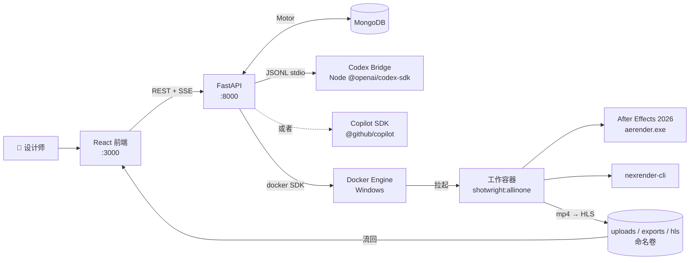

<div align="center">

# Shotwright

[English](README.md) | 简体中文

### 容器化的 After Effects 运行时 —— 由 AI 智能体驱动

一个对话式产品：Copilot 或 Codex 智能体在 Windows 容器里操作真实的 Adobe After Effects。丢一段参考视频进去、口头描述创意，智能体就会自动出分镜、备素材、写 JSX、调 nexrender、把渲染好的 mp4 通过 HLS 流回浏览器 —— 设计师不必再去当 Windows 容器运维。

<p>
	
	
	
	
	
	
	
</p>

<p>
	<a href="https://github.com/machinepulse-ai/shotwright/stargazers">
		
	</a>
	<a href="https://github.com/machinepulse-ai/shotwright/network/members">
		
	</a>
</p>

</div>

> [!IMPORTANT]
> Shotwright 始终把 After Effects 放在工作流中心。它**不是**一个泛化的 AI 视频自动化产品，而是一套可复现的 AE 运行时基础设施加上一层智能体外壳：让系统接手配置、文件搬运、JSX、渲染队列和验收循环这些杂事，让设计师保留审美判断与最终控制权。

> [!NOTE]
> 本文约定：AI Agent 译为 **AI 智能体**；proxy 译为 **代理**；installer cache 译为 **安装缓存**；composition 译为 **合成**；worker container 译为 **工作容器**。宿主机和容器路径、runner 临时目录名、基础镜像标签、nexrender 包版本等共享默认值统一放在 [shotwright-config.json](shotwright-config.json)；[setup-versions.yml](setup-versions.yml) 仍然只负责当前选中的 AE 版本。AE 安装载荷会发布到 GHCR，并在镜像构建阶段烘焙进 `shotwright:allinone`。

<details>
<summary><strong>目录</strong></summary>

- [验证演示](#-验证演示)
- [为什么选择 Shotwright](#-为什么选择-shotwright)
- [AE-operation-benchmark（草稿）](#-ae-operation-benchmark草稿--暂未实现)
- [产品组成](#-产品组成)
- [架构](#-架构)
- [智能体工具](#-智能体工具)
- [快速开始](#-快速开始)
- [AE 运行时容器](#-ae-运行时容器)
- [CI 与 GHCR 安装镜像](#-ci-与-ghcr-安装镜像)
- [项目结构](#-项目结构)
- [Skills Bundle](#-skills-bundle)
- [设计说明](#-设计说明)
- [路线图](#-路线图)

</details>

## ✨ 验证演示

<p align="center">
	
</p>

GIF 是一段从真实 `validation.mp4` 截取的 4 秒循环片段。冒烟渲染会把整条链路跑一遍：启动 Windows 容器、加载 all-in-one 镜像、AE 26.2 启动、nexrender 解析 JSX 补丁、`aerender.exe` 产出 H.264 mp4，最后把文件复制到 `validation-data/output/`。

| 产物 | 状态 | 说明 |
| --- | --- | --- |
| `validation-preview.gif` | ✅ 已提交 | 由 `validation.mp4` 导出的 4 秒循环 README 演示资源 |
| `validation.mp4` | 🟡 本地生成 | 冒烟测试运行时产出的真实渲染结果 |
| `validation_motion.aep` | 🟡 本地生成 | 每次验证都会重新生成；不进 Git，避免不必要的二进制波动 |

## 🎬 为什么选择 Shotwright

多数 AI 视频产品都在缩小创作空间：更少的决定权、更少的控制面、更多的模板约束。Shotwright 选择相反的方向。

- 让 AE 设计师获得 AI 智能体带来的执行杠杆，而不必自己扛起 Windows 容器运维。
- 让渲染保持可复现、可回放、可审计 —— JSX、nexrender job 定义、mp4 产物都是一等公民。
- 把基础设施推到背景；创作判断留给人；循环是 `意图 → 智能体 → JSX → 渲染 → 复盘`。
- 把 After Effects 当作严肃的运行时基座，而不是面板脚本的包装壳。

## 🧪 AE-operation-benchmark（草稿 · 暂未实现）

motion graphics 智能体目前**没有公开的衡量尺**。Coding 有 `SWE-bench` 和 `HumanEval`；网页自动化有 `WebArena`；数学有 `AIME`。AE、3D、工业设计——所有判分信号无法自动验证的领域——都没有对应物。没有公开 leaderboard，头部模型团队就没有动力围绕 AE 做 RL 训练，Shotwright 的杠杆也只能慢慢积累。

**设想形态：** 先把 leaderboard 建起来。Shotwright 团队自己出第一版可复现的任务集 + 自动评分管线 + 公开榜单，邀请 OpenAI / Anthropic / Google 把各自智能体接进来跑分。Shotwright 同步开放工作容器 runtime —— 模型团队不必自己装 Windows 容器和 AE —— 基础设施门槛被踢掉，剩下的是纯粹的模型能力比拼。

| 设计维度 | 草图 |
| --- | --- |
| **任务集** | 约 500 题，分 5 类：*keyframe · mask · expression · comp-build · render-export*。每题 = 自然语言 prompt + 参考视频 + ground-truth `.aep`。 |
| **4 维度评分** | 视觉相似度（LPIPS / DreamSim vs 参考渲染）+ 结构相似度（comp / layer / keyframe count 匹配率）+ wall-time & token cost + 完成率，加权得到单一 0–100 分。 |
| **Ground truth** | 邀请 3–5 位资深 motion designer 同题各做一次，团队 review 选 best-of。**多 reference**而非单一答案 —— 绕开 creative 评估的"主观陷阱"，承认"行业级好"是一个集合而非一个点。 |
| **公开 leaderboard** | 部署在 GitHub Pages。每次提交带分数 + `.aep` + 渲染 mp4 + 复现命令；月度滚动 + season 总冠军。 |

**三年愿景：** AE-operation-benchmark 对 motion graphics 智能体的意义，类似 SWE-bench 之于 coding 智能体。如果头部团队开始在 model card 里披露 AE-bench 分数，pro 创意软件就有机会从边缘评测场景进入**模型能力竞争的主表格**。

> [!WARNING]
> **状态 —— 草稿。以上内容在本仓库中尚未实现。** 任务集没有发布、评分管线不存在、leaderboard 没有上线。本章节记录的是项目长期方向；具体动手时机会等到平台稳定之后再排，平台层近期工作见 [路线图](#-路线图)。

## 🧭 产品组成

三层在 Windows Server LTSC 2025 上协作：

| 层 | 技术栈 | 职责 |
| --- | --- | --- |
| **Web UI** | React 18 + TypeScript + Webpack 5 | 对话面板（AgentPanel）、后台管理（AdminPanel）、HLS 视频播放（VideoPlayer）、容器管理（ContainerManager） |
| **智能体运行时** | FastAPI · Motor（MongoDB）· Codex SDK bridge **或** Copilot SDK | 会话/工程/容器状态、智能体工具分发、SSE 流式响应、REST API |
| **AE 工作容器** | Windows 容器 · AE 26.2 · nexrender · ffmpeg · Python 3.13 · Node 20 | 执行 JSX 补丁、调用 `aerender.exe`、编码 mp4、回传产物 |

默认 Docker 镜像是 `shotwright:allinone` —— 后端、前端工具链、AE 安装载荷、nexrender、工作脚本全部装在一个 Windows 镜像里。

## 🏗️ 架构



同一个 Docker 引擎同时承载 MongoDB、后端、前端和按需拉起的 AE 工作容器。后端通过本机 Docker 命名管道（`\\.\pipe\docker_engine`）按会话启停工作容器。

## 🧰 智能体工具

智能体注册了 16 个自定义工具，全部在 [`agent_tools.py`](src/backend/app/services/agent_tools.py) 里，对应工作流的四个阶段：

| 阶段 | 工具 |
| --- | --- |
| **工作目录与容器生命周期** | `ensure_after_effects_container` · `inspect_workspace` · `stop_after_effects_container` |
| **工程生命周期** | `create_after_effects_project` · `create_empty_after_effects_project` · `list_uploaded_projects` · `select_active_project` · `export_project_archive` |
| **参考素材与资源准备** | `stage_reference_images` · `generate_storyboard_from_reference_video` · `generate_tts_audio` · `run_python_code`（在受管 venv 里跑 Pillow / 数据处理） |
| **AE 合成、渲染与复盘** | `create_reference_composition` · `create_lyrics_mv_project` · `run_after_effects_jsx` · `render_after_effects_project` |

`run_python_code` 跑在一个根据 `src/backend-config/requirements-aigc.txt` 哈希同步的 venv 里，智能体可以放心生成 PIL 素材、准备 numpy/scipy 数据、调用 Pillow，而不污染系统解释器。

## 🚀 快速开始

### A. 整套平台（Docker Compose）

```powershell
cd src
copy .env.example .env
# 编辑 .env —— 至少设置 SHOTWRIGHT_SECRET_KEY 和 SHOTWRIGHT_ADMIN_PASSWORD

# 工作容器镜像构建一次（默认 target = shotwright:allinone）
docker build --target shotwright -t shotwright:allinone .

# 拉起平台：mongo + backend + frontend
.\scripts\deploy.ps1 -Build -Detach

# 或者开发模式（后端热重载 + webpack-dev-server）
.\scripts\deploy.ps1 -Dev -Build
```

| 服务 | 地址 |
| --- | --- |
| Frontend | http://localhost:3000 |
| Backend API | http://localhost:8000/api |
| Swagger | http://localhost:8000/api/docs |

### B. 不用 Docker 的本地开发

需要本地 MongoDB 跑在 `localhost:27017`；如果要走通工作容器，还需要一台能跑 AE 的 Windows 宿主机。

```powershell
# 后端（FastAPI + Codex bridge）
cd src/backend
uv sync
uv run uvicorn app.main:app --reload --port 8000

# 前端（React + webpack-dev-server）
cd src/frontend
npm install
npm run dev
```

也可以用一键脚本：`.\src\scripts\dev.ps1`。

### C. 只验证 AE 运行时容器

适合只想确认 Windows 容器 + AE 安装 + nexrender 链路通不通的场景，不依赖整套平台。

```powershell
powershell -ExecutionPolicy Bypass -File .\scripts\validate\run_validation.ps1 -ImageTag shotwright:allinone
```

会产出 `validation-data/output/validation.mp4`。宿主机挂载和安装缓存两种变体见下面的 [AE 运行时容器](#-ae-运行时容器) 章节；安装缓存的完整流程见 [setup.md](setup.md)。

## 🪟 AE 运行时容器

根目录 [Dockerfile](Dockerfile) 是多阶段的。默认 `shotwright` target 会在构建期从 GHCR 拉取 AE 安装载荷并烘焙进镜像。

| Stage | 用途 | 典型 tag |
| --- | --- | --- |
| `base` | 共享工具链 —— choco、Node 20、Python 3.13、ffmpeg、git、vcredist | — |
| `after-effects-setup` | 引用 `ghcr.io/liuchangfreeman/shotwright/after-effects-setup:26.2` | （拉取，非构建） |
| `shotwright` | All-in-one AE 工作容器 —— 构建期安装 AE，启动时执行 `runtime_entrypoint.ps1` | `shotwright:allinone` |
| `backend` | FastAPI + codex-bridge + uv 依赖 | `shotwright:backend` |
| `frontend-build` → `frontend` | Webpack 生产构建 + 静态服务 | `shotwright:frontend` |

### AE 的三种运行模式

| 模式 | 适用场景 | 操作方式 |
| --- | --- | --- |
| **All-in-one（默认）** | 大多数人；服务按需拉起的工作容器 | `docker build --target shotwright -t shotwright:allinone .` —— 构建期 AE 已经烘焙进去 |
| **宿主机挂载** | 宿主机已经装好 AE，希望镜像更瘦 | 给 `run_validation.ps1` 传 `-AfterEffectsPayloadRoot $null`；脚本会按 `setup-versions.yml` 解析并挂载宿主机安装目录 |
| **安装缓存** | 离线 / 受代理环境；需要自己控制载荷来源 | 先拉取或本地构建安装载荷目录，再把 `-AfterEffectsPayloadRoot` 和 `-CreativeCloudHelperRoot` 传给 `run_validation.ps1`。完整流程在 [setup.md](setup.md) |

<details>
<summary><strong>带代理的构建示例</strong></summary>

```powershell
$proxy = 'http://proxy.example.com:8080'
docker build `
	--build-arg http_proxy=$proxy `
	--build-arg https_proxy=$proxy `
	--build-arg HTTP_PROXY=$proxy `
	--build-arg HTTPS_PROXY=$proxy `
	--target shotwright `
	-t shotwright:allinone .
```

</details>

<details>
<summary><strong>显式关闭启动时的 AE 重检</strong></summary>

```powershell
docker build --target shotwright --build-arg AUTO_INSTALL_AFTER_EFFECTS=0 -t shotwright:allinone .
```

</details>

### 环境要求

- Windows 宿主机（Windows 11 Pro 或 Windows Server LTSC 2025）
- Docker Desktop 处于 Windows 容器模式（`docker info --format '{{.OSType}}'` 返回 `windows`）
- 仅"宿主机挂载"模式需要：宿主机已安装与 `setup-versions.yml` 匹配的 AE

## 🔁 CI 与 GHCR 安装镜像

`.github/workflows/` 下的工作流跑在 `windows-2025` runner 上。

| 工作流 | 触发条件 | 用途 |
| --- | --- | --- |
| `ae-setup-publish` | 推送更改 `setup-versions.yml` 或手动触发 | 从 Adobe 下载 AE 安装包、给辅助 `Setup.exe` 打补丁、发布到 `ghcr.io/liuchangfreeman/shotwright/after-effects-setup:<version>` |
| `windows-container-validation` — `dockerfile-build` | 推送或 PR 改动 `Dockerfile` | 确认 `shotwright:allinone` 能正常构建 |
| `windows-container-validation` — `validation-render` | 手动 `workflow_dispatch` | 从 GHCR 拉取安装载荷并跑完整验证渲染 |

`ae-setup-publish` 把所有东西打包成 `nanoserver:ltsc2025` 镜像；`shotwright:allinone` 在构建期会拉这个镜像。除默认的 `GITHUB_TOKEN` 外不需要任何额外密钥。

## 📁 项目结构

```text
.
├── src/                              全栈平台（docker compose 入口）
│   ├── backend/                      FastAPI + MongoDB + 智能体运行时
│   │   ├── app/
│   │   │   ├── main.py               FastAPI 入口
│   │   │   ├── config.py             pydantic-settings 配置
│   │   │   ├── database.py           Motor 客户端 + cache/session 抽象层
│   │   │   ├── models/               Pydantic 模型（session, project, container, chat, media, admin, agent）
│   │   │   ├── routers/              sessions / projects / containers / agent / admin / streaming
│   │   │   ├── middleware/           管理员 JWT 认证
│   │   │   └── services/             agent_tools, codex_bridge, codex_runtime, copilot_runtime,
│   │   │                             container_manager, nexrender, reference_media, tts,
│   │   │                             image_attachments, video_streaming, project_manager …
│   │   └── codex-bridge/             给 @openai/codex-sdk 的 Node JSONL 桥
│   ├── frontend/                     React 18 + TS + Webpack 5
│   │   └── src/components/{AgentPanel,AdminPanel,VideoPlayer,ContainerManager}
│   ├── docker-compose.yml            生产栈（mongo + backend + frontend）
│   ├── docker-compose.dev.yml        热重载叠加层
│   ├── docker-compose.local-codex.yml  本地 Codex CLI 鉴权的可选覆盖
│   └── scripts/                      deploy.ps1 · dev.ps1 · cleanup.ps1 · runtime_smoke.py
├── scripts/                          工作容器侧的运行时和验证脚本
│   ├── runtime_entrypoint.ps1        容器启动（AE 重检 + bridge 启动）
│   ├── pull_container_image.py       面向 OCI 镜像源的代理友好下载器
│   ├── install/                      AE 安装缓存、版本读取、modify_setup_win.py
│   └── validate/                     create_validation_animation_project.jsx · validation_patch.jsx
│                                     validation_nexrender_job.json · run_validation.ps1
├── Dockerfile                        多阶段：base / after-effects-setup / shotwright / backend / frontend
├── shotwright-config.json            共享的宿主/容器路径与工具默认值
├── setup-versions.yml                当前选中的 AE 版本（驱动 ae-setup-publish 与 install_root）
├── validation-data/                  output/、templates/、work/ —— 本地生成
└── docs/                             README 资源（validation-preview.gif、setup-source-comparison*.svg）
```

## 🧠 Skills Bundle

Shotwright 的 Copilot skills 只放在 `.github/skills`。这个目录不进 Git；仓库启动路径检测到缺失时，会自动从当前版本对应的 release bundle 补齐。手动补齐：

```powershell
python .\scripts\skills\download_skills_bundle.py
```

修改后重新发布：改 `.github/skills` 下的文件，bump [shotwright-config.json](shotwright-config.json) 里的 `tooling.skills.artifactVersion`，然后：

```powershell
python .\scripts\skills\package_skills_bundle.py
python .\scripts\skills\publish_skills_release.py
```

## 📝 设计说明

- **镜像策略。** 默认工作镜像是 `shotwright:allinone`。服务按需拉起的工作容器、`docker-compose.dev.yml` 都基于这个预装好的镜像；老的 `shotwright:dev` 与单独 runtime 镜像的分裂已经合并。
- **仅补丁 JSX。** 验证用 JSX 只负责合成层修改；nexrender 负责渲染执行和产物路由 —— 当 AE 异常退出但 mp4 已经写好时，验证脚本会从 work 目录里捞回 `result.mp4`。
- **单一可预期产物。** 验证任务用 `outputExt: mp4` + `@nexrender/action-copy`，每次跑完只留下一个 mp4（不再有 `.done` 标记文件）。
- **可切换的智能体后端。** Agent provider 可插拔：`SHOTWRIGHT_AGENT_PROVIDER=copilot`（默认）走 GitHub Copilot SDK；`=codex` 走容器内 Node Codex bridge。两边的密钥可以并存，管理员在 AdminPanel 切换。
- **沙箱化的 Python 工具。** `run_python_code` 跑在一个受管 venv 里（`SHOTWRIGHT_PYTHON_TOOL_RUNTIME_DIR`），根据 `requirements-aigc.txt` 哈希同步，智能体永远不会污染系统 Python。
- **HLS 流式预览。** 渲染产物会被切成 HLS 片段，从共享 `hls` 卷服务；React 端的 `VideoPlayer` 用 `hls.js` 播放。

## 🗺️ 路线图

- [ ] 远程工作节点池，支持分布式渲染
- [ ] 多租户工程隔离与每用户配额
- [ ] 一等公民的产物保留与清理策略
- [ ] 更高层的任务模型，把设计师意图映射到容器化执行
- [ ] 验证命令构建器和异常恢复路径的集成测试
- [ ] 公开 Helm chart（compose label 已按 `app.kubernetes.io/*` 约定打好）

## 📄 许可证

MIT
