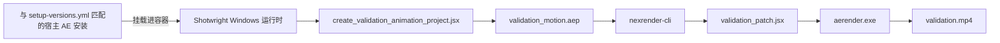
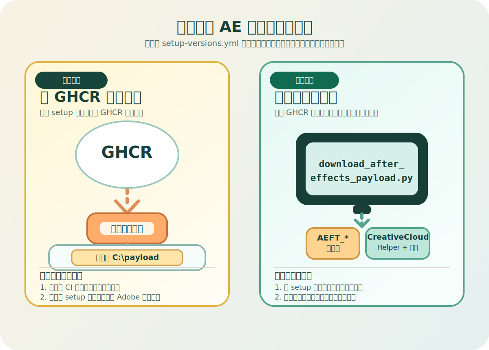

<div align="center">

# Shotwright

[English](README.md) | 简体中文

### 面向 AI 智能体的容器化 Adobe After Effects 运行时

构建 Windows 渲染工作节点，既可以挂载真实的 After Effects 安装，也可以从 GHCR 托管或本地准备的安装缓存自动安装；同时对 nexrender 输出做端到端验证，让设计师专注创意，而不是被基础设施拖住。

<p>
	
	
	
	
	
</p>

</div>

> [!IMPORTANT]
> Shotwright 始终把 After Effects 放在工作流中心。它不是泛化的 AI 视频自动化工具，而是一套可复现、可审计的 AE 运行时基础设施：让 AI 智能体接手重复的执行动作，让设计师保留审美判断与最终控制权。

> [!NOTE]
> 本文约定如下：AI Agent 统一译为“AI 智能体”；proxy 统一译为“代理”；installer cache 统一称为“安装缓存”。宿主机路径、容器路径、runner 临时目录名、基础镜像标签和 nexrender 版本等共享默认值，现在统一放在 [shotwright-config.json](shotwright-config.json)；`setup-versions.yml` 仍然只负责当前选中的 AE setup 版本。

<details>
<summary><strong>目录</strong></summary>

- [验证演示](#-验证演示)
- [为什么选择 Shotwright](#-为什么选择-shotwright)
- [核心能力](#-核心能力)
- [验证流程](#-验证流程)
- [环境要求](#-环境要求)
- [快速开始](#-快速开始)
- [CI 与 GHCR 安装镜像](#-ci-与-ghcr-安装镜像)
- [项目结构](#-项目结构)
- [设计说明](#-设计说明)
- [路线图](#-路线图)

</details>

## ✨ 验证演示


上方 GIF 截取自 validation mp4，是一个 4 秒循环的仓库内演示预览。冒烟测试本身仍会通过 Windows 容器、宿主机挂载的 After Effects 安装与 nexrender，稳定产出真实的 mp4 文件。

| 产物 | 状态 | 说明 |
| --- | --- | --- |
| `validation-preview.gif` | ✅ 已提交 | 由 `validation.mp4` 导出的 4 秒循环 README 演示资源 |
| `validation.mp4` | 🟡 本地生成 | 冒烟测试运行时产出的真实渲染结果 |
| `validation_motion.aep` | 🟡 本地生成 | 验证时重新生成，故意不纳入 Git，以避免不必要的二进制文件波动 |

## 🎬 为什么选择 Shotwright

多数 AI 视频产品都在缩小创作空间：更少的决定权、更少的控制面、更多的模板约束。Shotwright 选择相反的方向。

- 让 AE 设计师获得 AI 智能体带来的执行杠杆，而不必自己扛起 Windows 容器运维。
- 让验证渲染保持可复现、可回放、可审计。
- 让基础设施退到背景，把判断力和品味留给人。
- 把 After Effects 当作严肃的运行时基座，而不是面板脚本的包装壳。

## 🧰 核心能力

| 能力 | 实际含义 |
| --- | --- |
| Windows 运行时镜像 | 构建包含 Node.js、Python 3.13、ffmpeg、Git 与 nexrender 依赖的容器 |
| 宿主机挂载模式 | 直接使用与 `setup-versions.yml` 当前版本匹配的宿主机 AE 安装目录，而不是把 AE 打包进镜像 |
| 安装缓存模式 | 从 GHCR 托管或本地准备的安装缓存中安装 `setup-versions.yml` 当前选中的版本 |
| 验证工程生成 | 通过 JSX 生成可复现的 AEP，方便重复执行冒烟测试 |
| 仅补丁 JSX | 验证脚本只负责合成修改，渲染过程完全交由 nexrender |

## 🔄 验证流程



## 🧱 环境要求

- Windows 宿主机
- 已启用 Windows 容器模式的 Docker
- 满足以下任一条件：
	- 宿主机已安装与当前 `setup-versions.yml` 选择匹配的 Adobe After Effects
	- 按照第 3 步的 GHCR 优先流程获取安装载荷

> [!TIP]
> 预构建的安装载荷镜像已发布到 GHCR，Dockerfile 也已经通过 `http_proxy`、`https_proxy`、`HTTP_PROXY`、`HTTPS_PROXY` 构建参数内置代理支持。可用版本见 [setup-versions.yml](setup-versions.yml)。

## 🚀 快速开始

### 第 1 步 — 构建 Docker 镜像

- 做什么：生成一个预装 Node.js、Python、ffmpeg 与 nexrender 的 Windows 容器镜像。
- 结果：得到一个标签为 `shotwright:dev` 的本地 Docker 镜像。
- 能跳过吗：不能。这是后续所有步骤的基础。

```powershell
docker build -t shotwright:dev .
```

Dockerfile 默认启用 `AUTO_INSTALL_AFTER_EFFECTS=1`。容器启动时如果检测到挂载的安装缓存，就会自动安装 AE；如果没有检测到，则静默跳过。

如需显式关闭自动安装：

```powershell
docker build --build-arg AUTO_INSTALL_AFTER_EFFECTS=0 -t shotwright:dev .
```

<details>
<summary><strong>带代理的构建示例</strong></summary>

```powershell
$proxy = 'http://192.168.1.80:8080'
docker build `
	--build-arg http_proxy=$proxy `
	--build-arg https_proxy=$proxy `
	--build-arg HTTP_PROXY=$proxy `
	--build-arg HTTPS_PROXY=$proxy `
	-t shotwright:dev .
```

</details>

### 第 2 步 — 运行验证渲染（宿主机挂载模式）

- 做什么：启动容器，将 `setup-versions.yml` 当前版本对应的宿主机 AE 安装目录挂载进去，生成测试 AEP，并通过 nexrender 完成渲染。
- 结果：得到 `validation-data/output/validation.mp4`，一个 4 秒的 H.264 mp4 文件。
- 能跳过吗：如果你只关心安装缓存模式，可以直接跳到第 3 步。

```powershell
powershell -ExecutionPolicy Bypass -File .\scripts\validate\run_validation.ps1 -ImageTag shotwright:dev
```

### 第 3 步 — 运行验证渲染（安装缓存模式）

- 做什么：先从 `setup-versions.yml` 解析当前启用的 setup 版本，再按 GHCR 优先、本地脚本兜底的顺序准备安装缓存。
- 结果：得到与仓库当前 setup 选择一致的安装缓存目录，然后生成同样的 `validation-data/output/validation.mp4`。
- 能跳过吗：如果第 2 步已经覆盖了你的验证场景，这一步可选。

先解析当前启用的 setup 信息。这个脚本会直接读取 `setup-versions.yml`，后面的命令不需要再手写版本号：

```powershell
$setup = python .\scripts\install\setup_versions.py | ConvertFrom-Json
```

同一个对象还会给出 `$setup.install_root`，也就是当前版本期望使用的 AE 安装目录。

<p align="center">
	
</p>

优先路径：从 GHCR 拉取安装载荷并提取到本地目录：

```powershell
docker pull $setup.ghcr_image
docker create --name ae-setup $setup.ghcr_image cmd /c exit
docker cp 'ae-setup:C:\payload' 'C:\data\payload'
docker rm ae-setup
```

> [!IMPORTANT]
> Windows 安装镜像体积很大。如果 `docker pull` 经常超时或卡住，优先改用 `scripts/pull_container_image.py`。它会走 `http_proxy` 或 `https_proxy` 下载镜像、保存为本地 docker 归档，并且可以直接 `docker load`：
>
> ```powershell
> python .\scripts\pull_container_image.py --image $setup.ghcr_image --output-dir C:\data\images --load
> ```

兜底路径：在本地构建安装缓存：

```powershell
python .\scripts\install\download_after_effects_payload.py --payload-root C:\data\payload
$helperSetup = Join-Path (Join-Path 'C:\data\payload' $setup.helper_dir_name) 'HDBox\Setup.exe'
python .\scripts\install\modify_setup_win.py $helperSetup
```

运行：

```powershell
powershell -ExecutionPolicy Bypass -File .\scripts\validate\run_validation.ps1 `
	-ImageTag shotwright:dev `
	-AfterEffectsPayloadRoot (Join-Path 'C:\data\payload' $setup.payload_dir_name) `
	-CreativeCloudHelperRoot (Join-Path 'C:\data\payload' $setup.helper_dir_name)
```

## 🧱 CI 与 GHCR 安装镜像

`.github/workflows/` 下的 GitHub Actions 工作流使用 `windows-2025` 运行器。

| 工作流 | 触发条件 | 用途 |
| --- | --- | --- |
| `ae-setup-publish` | 推送更改 `setup-versions.yml` 或手动触发 | 从 Adobe 下载 AE 安装程序，打补丁后发布到 GHCR |
| `windows-container-validation` — `dockerfile-build` | 推送或 PR 修改 `Dockerfile` | 确认 Shotwright 镜像构建正常 |
| `windows-container-validation` — `validation-render` | 手动 `workflow_dispatch` | 从 GHCR 拉取安装载荷，运行完整验证 |

`ae-setup-publish` 工作流读取 [setup-versions.yml](setup-versions.yml) 来确定要构建的 After Effects 版本。它从 Adobe 公开目录下载安装载荷、给辅助安装器 `Setup.exe` 打补丁，并将所有内容打包为 `nanoserver:ltsc2025` 容器镜像后推送到 GHCR。

`validation-render` 任务会自动从 GHCR 拉取安装镜像并提取载荷。除默认的 `GITHUB_TOKEN` 外不需要额外密钥。

## 📁 项目结构

```text
scripts/
	install/
		download_after_effects_payload.py       从 Adobe 目录下载 AE 安装缓存
		download_utils.py                       Adobe 目录与下载辅助工具
		install_after_effects_in_container.ps1  在容器内从安装缓存安装 AE
		modify_setup_win.py                     给 Adobe 辅助安装器 Setup.exe 打补丁
		setup_versions.py                       从 setup-versions.yml 读取当前 setup 版本和派生目录名
	validate/
		create_validation_animation_project.jsx  生成测试 AEP
		run_validation.ps1                      手动冒烟测试入口
		validation_nexrender_job.json           最小化 nexrender 任务定义
		validation_patch.jsx                    仅做补丁的 JSX 脚本
	runtime_entrypoint.ps1                    容器启动脚本
	pull_container_image.py                   面向 GHCR、MCR 等 OCI 镜像源的代理下载脚本

validation-data/
	output/                                   渲染输出产物
	templates/                                生成的验证 AEP 文件
	work/                                     nexrender 工作目录与日志
```

## 📝 设计说明

- Docker 镜像本身不包含 Adobe After Effects。
- 运行时既可以挂载 `setup-versions.yml` 当前版本对应的宿主机 AE 安装目录，也可以把安装缓存中的同版本 AE 安装到容器内对应路径；安装缓存既可以来自 GHCR，也可以来自本地脚本构建结果，并统一挂载到 `C:\data\payload`。
- 容器启动时会执行 `scripts/runtime_entrypoint.ps1`。当 `AUTO_INSTALL_AFTER_EFFECTS=1` 且检测到安装缓存目录时，会自动安装 AE；否则直接跳过。
- 验证用 JSX 只负责补丁逻辑，渲染执行与输出管理由 nexrender 统一负责。
- 验证任务通过 `outputExt: mp4` 和 `@nexrender/action-copy` 保证最终只留下一个稳定、可预期的视频产物。

## 🗺️ 路线图

- [ ] 为验证命令构建器和异常恢复路径补充集成测试。
- [ ] 支持远程工作节点池和分布式渲染调度。
- [ ] 为任意用户 AEP 上传构建可复现的任务打包流程。
- [ ] 增加产物保留与清理策略。
- [ ] 构建更高层的任务模型，把设计师意图映射到容器化执行。

## 📄 许可证

MIT
