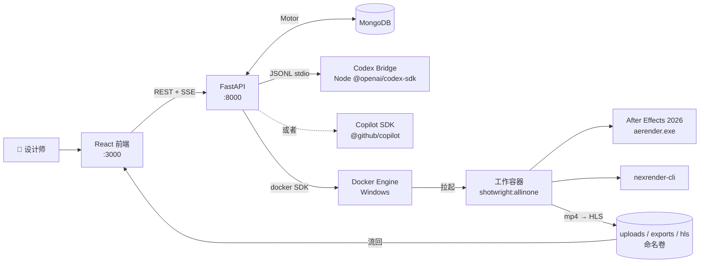

<div align="center">

# Shotwright

[English](README.md) | 简体中文

### 容器化的 After Effects 运行时 —— 由 AI 智能体驱动

一个对话式产品：Copilot 或 Codex 智能体在 Windows 容器里操作真实的 Adobe After Effects。丢一段参考视频进去、口头描述创意，智能体就会自动出分镜、备素材、写 JSX 自动化脚本（After Effects 的内置脚本语言）、通过 nexrender（AE 的无头渲染调度工具）完成渲染、把渲染好的 mp4 流式推回浏览器 —— 设计师不必再去当 Windows 容器运维。

<p>
	
	
	
	
	
	
	
</p>

<p>
	<a href="https://github.com/machinepulse-ai/shotwright/stargazers">
		
	</a>
	<a href="https://github.com/machinepulse-ai/shotwright/network/members">
		
	</a>
</p>

</div>

> [!IMPORTANT]
> Shotwright 始终把 After Effects 放在工作流中心。它**不是**一个泛化的 AI 视频自动化产品，而是一套可复现的 AE 运行时 + AI 智能体层：让系统接手配置、文件搬运、JSX 脚本编写、渲染队列和验收循环这些杂事，让设计师保留审美判断与最终控制权。

> [!NOTE]
> 术语说明：**JSX** 指 After Effects 内置的脚本语言；**nexrender** 是 AE 的无头渲染调度工具；**HLS** 指 HTTP Live Streaming（HTTP 分段流媒体）；**SSE** 指服务端推送（Server-Sent Events）。宿主机和容器路径、Docker 镜像标签、nexrender 包版本等共享默认值放在 [shotwright-config.json](shotwright-config.json)；AE 版本由 [setup-versions.yml](setup-versions.yml) 控制。AE 安装载荷发布到 GitHub Container Registry（GHCR），并在镜像构建阶段烘焙进 `shotwright:allinone`。

<details>
<summary><strong>目录</strong></summary>

- [验证演示](#-验证演示)
- [为什么选择 Shotwright](#-为什么选择-shotwright)
- [适合谁用](#-适合谁用)
- [AE 运行时容器](#-ae-运行时容器)
- [AE-operation-benchmark（草稿）](#-ae-operation-benchmark草稿--暂未实现)
- [产品组成](#-产品组成)
- [架构](#-架构)
- [智能体工具](#-智能体工具)
- [生产工作流](#-生产工作流)
- [快速开始](#-快速开始)
- [CI 与 GHCR 安装镜像](#-ci-与-ghcr-安装镜像)
- [项目结构](#-项目结构)
- [Skills Bundle](#-skills-bundle)
- [设计说明](#-设计说明)
- [路线图](#-路线图)

</details>

## ✨ 验证演示

<p align="center">
	
</p>

GIF 是一段从真实 `validation.mp4` 截取的 4 秒循环片段。冒烟测试会完整跑一遍整条渲染链路：启动 Windows 容器、加载 all-in-one 镜像、AE 26.2 启动、nexrender 解析 JSX 补丁脚本、`aerender.exe`（AE 命令行渲染器）产出 H.264 mp4，最后把文件复制到 `validation-data/output/`。

| 产物 | 状态 | 说明 |
| --- | --- | --- |
| `validation-preview.gif` | ✅ 已提交 | 由 `validation.mp4` 导出的 4 秒循环 README 演示资源 |
| `validation.mp4` | 🟡 本地生成 | 冒烟测试运行时产出的真实渲染结果 |
| `validation_motion.aep` | 🟡 本地生成 | 每次验证都会重新生成；不进 Git，避免不必要的二进制波动 |

## 🎬 为什么选择 Shotwright

多数 AI 视频产品都在缩小创作空间：更少的决定权、更少的控制面、更多的模板约束。Shotwright 选择相反的方向。

- 让 AE 设计师获得 AI 智能体带来的执行杠杆，而不必自己扛起 Windows 容器运维。
- 让渲染保持可复现、可回放、可审计 —— JSX、nexrender job 定义、mp4 产物都是一等公民。
- 把基础设施推到背景；创作判断留给人；循环是 `意图 → 智能体 → JSX → 渲染 → 复盘`。
- 把 After Effects 当作严肃的运行时基座，而不是面板脚本的包装壳。

## 🎯 适合谁用

Shotwright 面向的是 **Adobe After Effects 设计师**：想把重复的生产环节交给 AI 智能体，同时不想自己去折腾 Windows 基础设施运维。

| | 需要什么 | 说明 |
| --- | --- | --- |
| **必须有** | Adobe After Effects（熟练使用） | 你来判断产出。agent 写 JSX 脚本，但合成好不好看是你说了算。 |
| | Windows 宿主机 — 见下方[宿主机配置要求](#宿主机配置要求) | 最低 4 核 / 16 GB 内存，无需裸金属服务器或嵌套虚拟化。 |
| | GitHub Copilot 订阅 或 OpenAI API key（二选一） | 智能体后端必须有其一。Copilot 是默认；Codex 是备选。 |
| **基础了解即可** | Docker Desktop | 装好、切到 Windows 容器模式即可，不需要自己写 Dockerfile。 |
| | PowerShell | 只需会运行几条脚本命令来启动平台和跑验证。 |
| **完全不需要** | JSX / AE 脚本 | agent 来写脚本，你审查渲染结果。 |
| | Python 或 Node.js | 两者都打包在工作容器里。 |
| | nexrender / aerender 内部机制 | Shotwright 已经封装好，它们是实现细节。 |
| | 云基础设施 | 所有东西跑在一台 Windows 宿主机上。 |

反直觉的地方：一个对 Docker 一无所知的 AE 设计师，有一台 Windows 机器 + 一个 API key，花一个下午就能把整套环境跑起来。通常搭渲染农场才需要掌握的基础设施知识，Shotwright 已经包在里面了。

## 🪟 AE 运行时容器

Shotwright 使用**进程级 Windows 容器**——与 Linux `docker run` 完全相同的隔离模型。无需裸金属服务器，也不需要嵌套虚拟化。

> [!NOTE]
> **为什么用 Windows 容器？** After Effects 的命令行渲染器 `aerender.exe` 只能跑在 Windows 上，所以 Linux 容器不是选项。容器模型还带来了两个生产环境必要的特性：每个渲染会话拿到一个全新的隔离容器——某次崩溃不会波及下一次；镜像锁死了所有依赖版本（AE 版本、nexrender、ffmpeg、Python、Node），无论是开发机、CI 还是生产环境，每次渲染跑的都是同一套基准环境。容器把"在我机器上能跑"变成了"在镜像里能跑"。

### 宿主机配置要求

| | 最低 | 推荐 |
| --- | --- | --- |
| **CPU** | 4 核 | 8 核 |
| **内存** | 16 GB | 32 GB |
| **硬盘** | 60 GB | 128 GB SSD |
| **操作系统** | Windows 11 Pro 或 Windows Server LTSC 2025 | 同左 |

Docker Desktop 需处于 Windows 容器模式（`docker info --format '{{.OSType}}'` 返回 `windows`）。仅"宿主机挂载"模式需要在宿主机上额外安装与 `setup-versions.yml` 匹配的 AE。

### 镜像阶段

根目录 [Dockerfile](Dockerfile) 是多阶段的。默认 `shotwright` target 会在构建期从 GHCR 拉取 AE 安装载荷并烘焙进镜像。

| Stage | 用途 | 典型 tag |
| --- | --- | --- |
| `base` | 共享工具链 —— Chocolatey（Windows 包管理器）、Node 20、Python 3.13、ffmpeg、Git、Visual C++ 运行库 | — |
| `after-effects-setup` | 引用 `ghcr.io/machinepulse-ai/shotwright/after-effects-setup:26.2` | （拉取，非构建） |
| `shotwright` | All-in-one AE 工作容器 —— 构建期安装 AE，启动时执行 `runtime_entrypoint.ps1` | `shotwright:allinone` |
| `backend` | FastAPI + codex-bridge + uv 依赖 | `shotwright:backend` |
| `frontend-build` → `frontend` | Webpack 生产构建 + 静态服务 | `shotwright:frontend` |

### AE 的三种运行模式

| 模式 | 适用场景 | 操作方式 |
| --- | --- | --- |
| **All-in-one（默认）** | 大多数人；服务按需拉起的工作容器 | `docker build --target shotwright -t shotwright:allinone .` —— 构建期 AE 已经烘焙进去 |
| **宿主机挂载** | 宿主机已经装好 AE，希望镜像更瘦 | 给 `run_validation.ps1` 传 `-AfterEffectsPayloadRoot $null`；脚本会按 `setup-versions.yml` 解析并挂载宿主机安装目录 |
| **安装缓存** | 离线 / 受代理环境；需要自己控制载荷来源 | 先拉取或本地构建安装载荷目录，再把 `-AfterEffectsPayloadRoot` 和 `-CreativeCloudHelperRoot` 传给 `run_validation.ps1`。完整流程在 [setup.md](setup.md) |

<details>
<summary><strong>带代理的构建示例</strong></summary>

```powershell
$proxy = 'http://proxy.example.com:8080'
docker build `
	--build-arg http_proxy=$proxy `
	--build-arg https_proxy=$proxy `
	--build-arg HTTP_PROXY=$proxy `
	--build-arg HTTPS_PROXY=$proxy `
	--target shotwright `
	-t shotwright:allinone .
```

</details>

<details>
<summary><strong>显式关闭启动时的 AE 重检</strong></summary>

```powershell
docker build --target shotwright --build-arg AUTO_INSTALL_AFTER_EFFECTS=0 -t shotwright:allinone .
```

</details>

## 🧪 AE-operation-benchmark（草稿 · 暂未实现）

我们注意到，motion graphics 智能体目前还缺一个共享的衡量尺。Coding 有 `SWE-bench` 和 `HumanEval`；网页自动化有 `WebArena`；数学有 `AIME`。但 After Effects 这类专业创意工具还没有一个明显的对应物 —— 一部分是因为评分信号不太容易自动化，一部分是因为这一块的社区相对小。这一节描述的是我们想尝试的一种思路：做一套小而可复现的任务集 + 自动评分，让任何在 AE 上做智能体的人都能在同一组任务上对比结果。

目前还很初步的设计草图：

| 维度 | 初步设想 |
| --- | --- |
| **任务集** | 约 500 题，分 5 类：*关键帧（keyframe）· 遮罩（mask）· 表达式（expression）· 合成搭建（comp-build）· 渲染导出（render-export）*。每题 = 自然语言描述 + 参考视频 + 一份参考 `.aep` 工程文件。 |
| **评分** | 视觉相似度（用 LPIPS / DreamSim——感知图像质量相似度指标——对照参考渲染计算）+ 结构匹配（合成 / 图层 / 关键帧数量）+ 实际耗时与 token 消耗 + 完成率，合并成一个 0–100 的分数。 |
| **参考答案** | 由几位资深 motion designer 各做一遍；保留多份解，不强行选出唯一"正确答案"，避免假装创意工作存在唯一解。 |
| **分发** | GitHub Pages 排行榜。每次提交带分数、`.aep`、渲染 mp4 和复现命令 —— 所有产物公开可查。 |

很多地方我们也确实没想清楚：视觉相似度指标到底能不能反映设计师所说的"好"，500 题是不是合适的规模，团队之外是否真的会有人用这种格式，这些都还没答案。把它放进 README，是希望读者先知道项目的长期方向是一套共享评测面，仓库里其它内容才更容易理解 —— 不是只为单个团队做工具。

> [!NOTE]
> **状态 —— 草稿。** 任务集、评分管线、leaderboard 在本仓库里都还没有实现。如果你对设计感兴趣 —— 尤其是评分这一块，我们最不确定的地方 —— 欢迎开 issue 或 discussion 一起讨论。[路线图](#-路线图) 列的是平台层近期实际在做的工作。

## 🧭 产品组成

三层在 Windows Server LTSC 2025 上协作：

| 层 | 技术栈 | 职责 |
| --- | --- | --- |
| **Web UI** | React 18 + TypeScript + Webpack 5 | 对话面板（AgentPanel）、后台管理（AdminPanel）、HLS 流式视频播放（VideoPlayer，将渲染结果实时推送到浏览器）、容器管理（ContainerManager） |
| **智能体运行时** | FastAPI · Motor（MongoDB 异步驱动）· Codex SDK bridge **或** Copilot SDK | 会话/工程/容器状态、智能体工具分发、SSE（服务端推送）流式响应、REST API |
| **AE 工作容器** | Windows 容器 · AE 26.2 · nexrender · ffmpeg · Python 3.13 · Node 20 | 执行 JSX 补丁、调用 `aerender.exe`、编码 mp4、回传产物 |

默认 Docker 镜像是 `shotwright:allinone` —— 后端、前端工具链、AE 安装载荷、nexrender、工作脚本全部装在一个 Windows 镜像里。

## 🏗️ 架构



同一个 Docker 引擎同时承载 MongoDB、后端、前端和按需拉起的 AE 工作容器。后端通过本机 Docker 命名管道（`\\.\pipe\docker_engine`）按会话启停工作容器。

## 🧰 智能体工具

智能体注册了 16 个自定义工具，全部在 [`agent_tools.py`](src/backend/app/services/agent_tools.py) 里，对应工作流的四个阶段：

| 阶段 | 工具 |
| --- | --- |
| **工作目录与容器生命周期** | `ensure_after_effects_container` · `inspect_workspace` · `stop_after_effects_container` |
| **工程生命周期** | `create_after_effects_project` · `create_empty_after_effects_project` · `list_uploaded_projects` · `select_active_project` · `export_project_archive` |
| **参考素材与资源准备** | `stage_reference_images` · `generate_storyboard_from_reference_video` · `generate_tts_audio` · `run_python_code`（在受管 venv 里跑 Pillow / 数据处理） |
| **AE 合成、渲染与复盘** | `create_reference_composition` · `create_lyrics_mv_project` · `run_after_effects_jsx` · `render_after_effects_project` |

`run_python_code` 跑在一个根据 `src/backend-config/requirements-aigc.txt` 自动同步的独立 Python 虚拟环境（venv）里，智能体可以用 Pillow 生成图片、处理数据，而不会向系统 Python 安装任何包。

## 🔄 生产工作流

从原片到成品 mp4 的完整链路：

| 步骤 | 执行方 | 发生了什么 |
| --- | --- | --- |
| **1. 上传** | 人 | 丢入源视频，在对话框里描述创意需求 |
| **2. 分镜抽帧** | Agent | ffmpeg 按固定时间间隔采样帧，agent 分析视觉结构 |
| **3. ASR** | Agent | 对音轨跑语音识别，提取旁白或对话文本 |
| **4. TTS** | Agent + 人 | agent 生成候选配音；人选定偏好的版本 |
| **5. 素材生成** | Agent | Python + Pillow 批量生成字幕条、下三分之一、数据图表等图层素材 |
| **6. AE 合成 + 渲染** | Agent | agent 写 JSX 补丁脚本、nexrender 执行渲染、mp4 流式推回浏览器 |
| **7. 视觉验收循环** | 人 | 设计师审片，通过则结束；不通过则口述修改意见，循环继续 |

### Human-in-the-loop

上面的流程并非全自动。Shotwright 的设计是把**可重复、可机器验证的步骤交给 agent**，把**判断和品味留给人**：

| | 内容 | 谁来决定 |
| --- | --- | --- |
| **机器全自动** | 上传、分镜抽帧、ASR、Pillow 批量制图 | Agent —— 有客观标准，不需要人介入 |
| **Agent 主导 · 人审一眼** | TTS 音色挑选、JSX 脚本审查、疑似不通过的验收样本 | 人 —— 每次几秒到几分钟；这是最高频的人机交接面 |
| **强人工判定** | 创意审美（logo 入场利不利落、字距是否过松）、品牌一致性、最终是否上线 | 设计师 —— 没有可机器化的正确答案 |

Shotwright 接走的是配机器、写脚本、跑渲染、逐帧验证这些杂事——审美判断仍然留给设计师。

## 🚀 快速开始

Shotwright 是 AI-native 项目。推荐的安装路径是将宿主机配置完全交给 Claude Code 或 Codex 智能体来完成，而不是手动逐步执行。提供一台开放 SSH 端口的 Windows 虚拟机和必要的代理设置，智能体会处理 Docker 安装、切换 Windows 容器模式、构建镜像、配置 `.env` 和启动服务的全部工作。

### 智能体驱动的安装（推荐）

1. 购置一台满足[宿主机配置要求](#宿主机配置要求)的 Windows 虚拟机，开放 SSH 端口（无需裸金属或嵌套虚拟化）。
2. 在本机 clone 本仓库，用 Claude Code 或 Codex 打开一个会话。
3. 告诉智能体：宿主机 IP、SSH key 路径、代理地址（如有），以及保存 Copilot 或 OpenAI API key 的本地环境变量名或密钥存储位置。
4. 安装时使用临时、可撤销的 SSH key 和最小权限 API key。不建议使用 SSH 密码认证，也不要把 API key 或长期凭据直接粘贴到聊天记录里。
5. 智能体将自动完成：安装 Docker Desktop、切换到 Windows 容器模式、构建 `shotwright:allinone`、配置 `.env`、启动完整平台。
6. 智能体报告完成后，访问 `http://<host-ip>:3000`。

### 手动安装

#### A. 整套平台（Docker Compose）

```powershell
# 工作容器镜像构建一次（默认 target = shotwright:allinone）
docker build --target shotwright -t shotwright:allinone .

cd src
copy .env.example .env
# 编辑 .env —— 至少设置 SHOTWRIGHT_SECRET_KEY 和 SHOTWRIGHT_ADMIN_PASSWORD

# 拉起平台：mongo + backend + frontend
.\scripts\deploy.ps1 -Build -Detach

# 或者开发模式（后端热重载 + webpack-dev-server）
.\scripts\deploy.ps1 -Dev -Build
```

| 服务 | 地址 |
| --- | --- |
| Frontend | http://localhost:3000 |
| Backend API | http://localhost:8000/api |
| Swagger | http://localhost:8000/api/docs |

#### B. 不用 Docker 的本地开发

需要本地 MongoDB 跑在 `localhost:27017`；如果要走通工作容器，还需要一台能跑 AE 的 Windows 宿主机。

```powershell
# 后端（FastAPI + Codex bridge）
cd src/backend
uv sync
uv run uvicorn app.main:app --reload --port 8000

# 前端（React + webpack-dev-server）
cd src/frontend
npm install
npm run dev
```

也可以用一键脚本：`.\src\scripts\dev.ps1`。

#### C. 只验证 AE 运行时容器

适合只想确认 Windows 容器 + AE 安装 + nexrender 链路通不通的场景，不依赖整套平台。

```powershell
powershell -ExecutionPolicy Bypass -File .\scripts\validate\run_validation.ps1 -ImageTag shotwright:allinone
```

会产出 `validation-data/output/validation.mp4`。安装缓存的完整流程见 [setup.md](setup.md)。

## 🔁 CI 与 GHCR 安装镜像

`.github/workflows/` 下的工作流默认跑在组织的 `windows-latest-8-cores` Windows larger runner 标签上。

| 工作流 | 触发条件 | 用途 |
| --- | --- | --- |
| `ae-setup-publish` | 推送更改 `setup-versions.yml` 或手动触发 | 从 Adobe 下载 AE 安装包、给辅助 `Setup.exe` 打补丁、发布到 `ghcr.io/machinepulse-ai/shotwright/after-effects-setup:<version>` |
| `windows-container-validation` — `dockerfile-build` | 推送或 PR 改动 `Dockerfile` | 确认 `shotwright:allinone` 能正常构建 |
| `windows-container-validation` — `validation-render` | 手动 `workflow_dispatch` | 从 GHCR 拉取安装载荷并跑完整验证渲染 |

`ae-setup-publish` 把 AE 安装包打包成一个极简 Windows Nano Server 镜像（`nanoserver:ltsc2025`）；`shotwright:allinone` 在构建期会拉这个镜像。CI 会先用默认 `GITHUB_TOKEN` 执行 `docker login ghcr.io`，再拉取组织内部 GHCR 包。

## 📁 项目结构

```text
.
├── src/                              全栈平台（docker compose 入口）
│   ├── backend/                      FastAPI + MongoDB + 智能体运行时
│   │   ├── app/
│   │   │   ├── main.py               FastAPI 入口
│   │   │   ├── config.py             pydantic-settings 配置
│   │   │   ├── database.py           Motor 客户端 + cache/session 抽象层
│   │   │   ├── models/               Pydantic 模型（session, project, container, chat, media, admin, agent）
│   │   │   ├── routers/              sessions / projects / containers / agent / admin / streaming
│   │   │   ├── middleware/           管理员 JWT 认证
│   │   │   └── services/             agent_tools, codex_bridge, codex_runtime, copilot_runtime,
│   │   │                             container_manager, nexrender, reference_media, tts,
│   │   │                             image_attachments, video_streaming, project_manager …
│   │   └── codex-bridge/             给 @openai/codex-sdk 的 Node JSONL 桥
│   ├── frontend/                     React 18 + TS + Webpack 5
│   │   └── src/components/{AgentPanel,AdminPanel,VideoPlayer,ContainerManager}
│   ├── docker-compose.yml            生产栈（mongo + backend + frontend）
│   ├── docker-compose.dev.yml        热重载叠加层
│   ├── docker-compose.local-codex.yml  本地 Codex CLI 鉴权的可选覆盖
│   └── scripts/                      deploy.ps1 · dev.ps1 · cleanup.ps1 · runtime_smoke.py
├── scripts/                          工作容器侧的运行时和验证脚本
│   ├── runtime_entrypoint.ps1        容器启动（AE 重检 + bridge 启动）
│   ├── pull_container_image.py       面向 OCI 镜像源的代理友好下载器
│   ├── install/                      AE 安装缓存、版本读取、modify_setup_win.py
│   └── validate/                     create_validation_animation_project.jsx · validation_patch.jsx
│                                     validation_nexrender_job.json · run_validation.ps1
├── Dockerfile                        多阶段：base / after-effects-setup / shotwright / backend / frontend
├── shotwright-config.json            共享的宿主/容器路径与工具默认值
├── setup-versions.yml                当前选中的 AE 版本（驱动 ae-setup-publish 与 install_root）
├── validation-data/                  output/、templates/、work/ —— 本地生成
└── docs/                             README 资源（validation-preview.gif、setup-source-comparison*.svg）
```

## 🧠 Skills Bundle

Shotwright 的 Copilot skills 只放在 `.github/skills`。这个目录不进 Git；仓库启动路径检测到缺失时，会自动从当前版本对应的 release bundle 补齐。手动补齐：

```powershell
python .\scripts\skills\download_skills_bundle.py
```

修改后重新发布：改 `.github/skills` 下的文件，bump [shotwright-config.json](shotwright-config.json) 里的 `tooling.skills.artifactVersion`，然后：

```powershell
python .\scripts\skills\package_skills_bundle.py
python .\scripts\skills\publish_skills_release.py
```

## 📝 设计说明

- **镜像策略。** 默认工作镜像是 `shotwright:allinone`。服务按需拉起的工作容器、`docker-compose.dev.yml` 都基于这个预装好的镜像；老的 `shotwright:dev` 与独立 runtime 镜像的拆分已经合并。
- **JSX 脚本只做合成修改。** 验证用的 JSX 脚本只负责修改合成层属性；nexrender 负责渲染执行和产物路由 —— 如果 AE 异常退出但 mp4 已经写好，验证脚本会从工作目录里找回 `result.mp4`。
- **每次只输出一个文件。** 验证任务使用 `outputExt: mp4` + `@nexrender/action-copy`，每次跑完只留下一个 mp4 文件（不再有 `.done` 标记文件）。
- **可切换的智能体后端。** `SHOTWRIGHT_AGENT_PROVIDER=copilot`（默认）使用 GitHub Copilot SDK；`=codex` 将请求路由到容器内的 Node.js Codex Bridge。两套密钥可以并存，管理员在 AdminPanel 里切换。
- **隔离的 Python 沙箱。** `run_python_code` 跑在一个独立虚拟环境（`SHOTWRIGHT_PYTHON_TOOL_RUNTIME_DIR`）里，依赖从 `requirements-aigc.txt` 自动派生，智能体永远不会向系统 Python 安装任何包。
- **HLS 流式预览。** 渲染产物会被切成 HLS（HTTP Live Streaming）分段，从共享 `hls` 卷对外服务；React 端的 `VideoPlayer` 用 `hls.js` 播放。

## 🗺️ 路线图

- [ ] 远程工作节点池，支持分布式渲染
- [ ] 多租户工程隔离与每用户配额
- [ ] 一等公民的产物保留与清理策略
- [ ] 更高层的任务模型，把设计师意图映射到容器化执行
- [ ] 验证命令构建器和异常恢复路径的集成测试
- [ ] 公开 Helm chart（compose label 已按 `app.kubernetes.io/*` 约定打好）

## 📄 许可证

MIT
