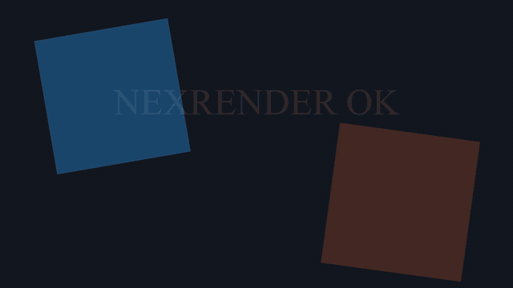
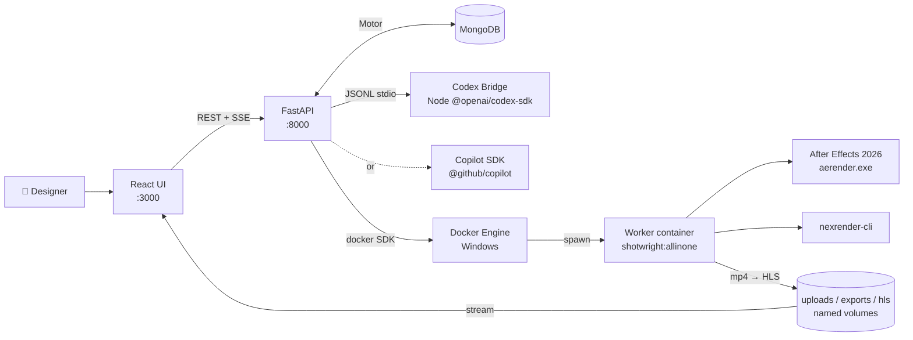

<div align="center">

# Shotwright

[简体中文](README-cn.md) | English

### An AI agent that runs real Adobe After Effects inside a Windows container

A chat-driven product where a Copilot or Codex agent operates real Adobe After Effects inside a Windows container. Drop in a reference video, describe what you want, and watch the agent plan the footage, prepare assets, write JSX automation scripts (After Effects' built-in scripting language), hand them off to nexrender (a headless render runner for AE), and stream the finished mp4 back to the browser — without asking designers to manage Windows containers.

<p>
	
	
	
	
	
	
	
</p>

<p>
	<a href="https://github.com/machinepulse-ai/shotwright/stargazers">
		
	</a>
	<a href="https://github.com/machinepulse-ai/shotwright/network/members">
		
	</a>
</p>

</div>

> [!IMPORTANT]
> Shotwright keeps After Effects at the center. The goal is **not** generic AI video automation — it is a reproducible AE runtime with an AI agent layer on top, so designers keep creative judgment and control while the system handles configuration, file management, JSX scripting, render queueing, and review loops.

> [!NOTE]
> Shared defaults — host/container paths, CI runner directories, Docker image tags, and nexrender package versions — are defined in [shotwright-config.json](shotwright-config.json). The After Effects version is controlled by [setup-versions.yml](setup-versions.yml). The AE installer payload is published to GitHub Container Registry (GHCR) and baked into `shotwright:allinone` at build time.

<details>
<summary><strong>Jump to section</strong></summary>

- [Validation Demo](#-validation-demo)
- [Why Shotwright](#-why-shotwright)
- [Who is this for](#-who-is-this-for)
- [AE Runtime Container](#-ae-runtime-container)
- [AE-operation-benchmark (draft)](#-ae-operation-benchmark-draft--not-yet-implemented)
- [What's Inside](#-whats-inside)
- [Architecture](#-architecture)
- [Agent Tools](#-agent-tools)
- [Production Workflow](#-production-workflow)
- [Getting Started](#-getting-started)
- [CI and GHCR Setup Images](#-ci-and-ghcr-setup-images)
- [Project Layout](#-project-layout)
- [Skills Bundle](#-skills-bundle)
- [Design Notes](#-design-notes)
- [Roadmap](#-roadmap)

</details>

## ✨ Validation Demo

<p align="center">
	
</p>

The GIF is a short looping cut from a real `validation.mp4`. The smoke render exercises every layer of the stack — a Windows container starts the all-in-one image, AE 26.2 boots, nexrender resolves a JSX patch, `aerender.exe` produces an H.264 mp4, and the file is copied to `validation-data/output/`.

| Artifact | Status | Notes |
| --- | --- | --- |
| `validation-preview.gif` | ✅ committed | 4-second looping README demo asset cut from `validation.mp4` |
| `validation.mp4` | 🟡 generated locally | Smoke-test render produced during validation runs |
| `validation_motion.aep` | 🟡 generated locally | Regenerated each run; excluded from Git to avoid binary churn |

## 🎬 Why Shotwright

Most AI video products shrink the creative surface area: fewer decisions, fewer controls, more templates. Shotwright bets the other way.

- Give AE designers AI-agent leverage without asking them to become Windows container operators.
- Keep renders reproducible, replayable, and auditable — JSX, nexrender job specs, and mp4 outputs are first-class artifacts.
- Push infrastructure into the background. Creative judgment stays with the human; the loop is `intent → agent → JSX → render → review`.
- Treat After Effects as a serious runtime foundation, not a thin wrapper around a panel script.

## 🎯 Who is this for

Shotwright targets **After Effects designers** who want to offload repetitive production work to an AI agent without becoming Windows infrastructure operators.

| | What you need | Notes |
| --- | --- | --- |
| **Must have** | Adobe After Effects (proficient) | You judge the output. The agent writes JSX scripts, but whether the comp looks right is your call. |
| | Windows host — see [host requirements](#host-requirements) below | Min 4 cores / 16 GB RAM. No bare-metal or nested virtualization needed. |
| | GitHub Copilot subscription *or* OpenAI API key | One agent backend is required. Copilot is the default; Codex is the alternative. |
| **Basic familiarity** | Docker Desktop | Install and switch to Windows-container mode. No Dockerfile writing required. |
| | PowerShell | A handful of commands to start the platform and run validation. |
| **Not required** | JSX / AE scripting | The agent writes the scripts. You review the render. |
| | Python or Node.js | Both are bundled inside the worker container. |
| | nexrender / aerender internals | Shotwright wraps both. They are implementation details. |
| | Cloud infrastructure | Everything runs on a single Windows host. |

An AE designer with no Docker background can get the full stack running in an afternoon. The infrastructure knowledge normally required to stand up a render farm stays inside Shotwright.

## 🪟 AE Runtime Container

Shotwright uses **process-level Windows containers** — the same isolation model as Linux `docker run`. No bare-metal server or nested virtualization is required.

> [!NOTE]
> **Why Windows containers?** `aerender.exe` — After Effects' command-line renderer — is Windows-only, so Linux containers are not an option. The container model adds two production-critical properties on top of that: each render session gets a fresh isolated container (one crash cannot affect the next), and the image pins every dependency — AE version, nexrender, ffmpeg, Python, Node — so every render runs against the same baseline on a developer's machine, in CI, or in production. The container turns "works on my machine" into "works in the image."

### Host requirements

| | Minimum | Recommended |
| --- | --- | --- |
| **CPU** | 4 cores | 8 cores |
| **RAM** | 16 GB | 32 GB |
| **Disk** | 60 GB | 128 GB SSD |
| **OS** | Windows 11 Pro or Windows Server LTSC 2025 | Same |

Docker Desktop must be running in Windows-container mode (`docker info --format '{{.OSType}}'` returns `windows`). For the host-mount mode only, a matching AE install is also required on the host.

### Image stages

The root [Dockerfile](Dockerfile) is multi-stage. The default `shotwright` target bakes the AE installer payload (pulled from GHCR at build time) directly into the image.

| Stage | Purpose | Typical tag |
| --- | --- | --- |
| `base` | Shared toolchain — Chocolatey, Node 20, Python 3.13, ffmpeg, Git, Visual C++ runtime | — |
| `after-effects-setup` | Reference to `ghcr.io/machinepulse-ai/shotwright/after-effects-setup:26.2` | (pulled, not built) |
| `shotwright` | All-in-one AE worker — installs AE during build, runs `runtime_entrypoint.ps1` at startup | `shotwright:allinone` |
| `backend` | FastAPI + codex-bridge + uv dependencies | `shotwright:backend` |
| `frontend-build` → `frontend` | Webpack production build + static server | `shotwright:frontend` |

### Three runtime modes for AE

| Mode | When to use | How |
| --- | --- | --- |
| **All-in-one (default)** | Most users; service-spawned worker containers | `docker build --target shotwright -t shotwright:allinone .` — AE is baked in at build time |
| **Host-mount** | You already have AE installed on the Windows host and want a thinner image | Pass `-AfterEffectsPayloadRoot $null` to `run_validation.ps1`; the script mounts the host install resolved from `setup-versions.yml` |
| **Installer-cache** | Air-gapped or proxy-restricted builds; want to control payload provenance | Pull or build a payload directory, then pass `-AfterEffectsPayloadRoot` and `-CreativeCloudHelperRoot` to `run_validation.ps1`. Detailed walkthrough in [setup.md](setup.md) |

<details>
<summary><strong>Proxy-friendly build example</strong></summary>

```powershell
$proxy = 'http://proxy.example.com:8080'
docker build `
	--build-arg http_proxy=$proxy `
	--build-arg https_proxy=$proxy `
	--build-arg HTTP_PROXY=$proxy `
	--build-arg HTTPS_PROXY=$proxy `
	--target shotwright `
	-t shotwright:allinone .
```

</details>

<details>
<summary><strong>Disable the AE re-check at container startup</strong></summary>

```powershell
docker build --target shotwright --build-arg AUTO_INSTALL_AFTER_EFFECTS=0 -t shotwright:allinone .
```

</details>

## 🧪 AE-operation-benchmark *(draft — not yet implemented)*

We've noticed that motion-graphics agents don't yet have a shared yardstick the way other domains do. Coding has `SWE-bench` and `HumanEval`; web automation has `WebArena`; math has `AIME`. After Effects and adjacent pro creative tools don't have an obvious counterpart — partly because the judging signal is harder to automate, partly because the community working on this is smaller. This section sketches one approach we'd like to try: a small, reproducible task set with automated scoring, so anyone building an agent for AE can compare results on the same ground.

Early-stage design sketch:

| Aspect | Initial thinking |
| --- | --- |
| **Task set** | Around 500 tasks across 5 categories — *keyframe · mask · expression · comp-build · render-export*. Each task = natural-language prompt + reference video + a ground-truth `.aep`. |
| **Scoring** | Visual similarity (LPIPS / DreamSim — perceptual image quality metrics — against a reference render) + structural match (composition, layer, and keyframe counts) + elapsed time and token cost + completion rate, combined into a single 0–100 score. |
| **Ground truth** | Several senior motion designers solve each task; we'd keep multiple solutions rather than picking one "correct" answer, to avoid pretending creative work has a unique right answer. |
| **Distribution** | A GitHub Pages leaderboard. Each submission would ship the score, the `.aep`, a rendered mp4, and a repro command — so results stay inspectable. |

A lot of this is genuinely uncertain. We don't yet know whether the visual-similarity metrics correlate with what designers call "good", whether 500 is the right number of tasks, or whether anyone outside the team will find the format useful. We're putting the section in the README mostly because the rest of the repo makes more sense once you know we're aiming for a shared evaluation surface over time, not just better tooling for a single studio.

> [!NOTE]
> **Status — draft.** None of this is implemented in the repo today: no task set, no scoring pipeline, no leaderboard. If you'd like to talk through the design — particularly the scoring side, which is where we're least confident — please open an issue or a discussion. The [Roadmap](#-roadmap) covers the platform work that's actually being built right now.

## 🧭 What's Inside

Three cooperating layers, all running on Windows Server LTSC 2025:

| Layer | Stack | Responsibility |
| --- | --- | --- |
| **Web UI** | React 18 + TypeScript + Webpack 5 | Chat console (AgentPanel), admin panel (AdminPanel), HLS video player (VideoPlayer — streams renders to the browser), container manager |
| **Agent runtime** | FastAPI · Motor (async MongoDB driver) · Codex SDK bridge **or** Copilot SDK | Session/project/container state, agent tool dispatch, server-sent events (SSE) streaming, REST API |
| **AE runtime worker** | Windows container · AE 26.2 · nexrender · ffmpeg · Python 3.13 · Node 20 | Executes JSX patches, drives `aerender.exe`, encodes mp4, returns artifacts |

The default Docker image is `shotwright:allinone` — backend, frontend toolchain, AE setup payload, nexrender, and worker scripts in a single Windows image.

## 🏗️ Architecture



Same physical Docker engine hosts MongoDB, backend, frontend, and on-demand AE worker containers. The backend talks to the local Docker named pipe (`\\.\pipe\docker_engine`) to start a worker container per session and tear it down when idle.

## 🧰 Agent Tools

The agent has 16 custom tools registered in [`agent_tools.py`](src/backend/app/services/agent_tools.py). They map onto a four-phase workflow:

| Phase | Tools |
| --- | --- |
| **Workspace & container lifecycle** | `ensure_after_effects_container` · `inspect_workspace` · `stop_after_effects_container` |
| **Project lifecycle** | `create_after_effects_project` · `create_empty_after_effects_project` · `list_uploaded_projects` · `select_active_project` · `export_project_archive` |
| **Reference & asset prep** | `stage_reference_images` · `generate_storyboard_from_reference_video` · `generate_tts_audio` · `run_python_code` *(Pillow / data prep in a managed venv)* |
| **AE composition, render & review** | `create_reference_composition` · `create_lyrics_mv_project` · `run_after_effects_jsx` · `render_after_effects_project` |

`run_python_code` runs in an isolated Python environment built from `src/backend-config/requirements-aigc.txt`, so the agent can generate images and run data-processing scripts with Pillow without touching the system Python install.

## 🔄 Production Workflow

A complete run from raw footage to a finished mp4, as the agent executes it:

| Step | Who | What happens |
| --- | --- | --- |
| **1. Upload** | Human | Drop in the source video and describe the creative brief in the chat |
| **2. Storyboard extraction** | Agent | ffmpeg samples frames at a fixed interval; the agent inspects the visual structure |
| **3. ASR** | Agent | Speech-to-text runs on the audio track to capture narration or dialogue |
| **4. TTS** | Agent + Human | Agent generates candidate voice-over audio; human selects the preferred take |
| **5. Asset generation** | Agent | Python + Pillow builds text overlays, lower-thirds, and data-driven graphics |
| **6. AE composition + render** | Agent | Agent writes JSX patches for the AE project, nexrender executes the render, mp4 streams back to the browser |
| **7. Visual QA loop** | Human | Designer reviews the mp4 and either approves or narrates corrections; the loop repeats until the comp passes |

### Human-in-the-loop

The pipeline is not fully autonomous. Shotwright routes **repeatable, machine-verifiable steps to the agent** and **reserves judgment calls for the designer**:

| | What | Who decides |
| --- | --- | --- |
| **Fully automated** | Upload, storyboard extraction, ASR, batch image generation | Agent — objective criteria, no human sign-off needed |
| **Agent proposes, human approves** | TTS voice selection, JSX script review, flagged QA samples | Human — seconds to a few minutes per call; the most common handoff point |
| **Human judgment only** | Creative aesthetics, brand consistency, final go/no-go | Designer — no automated scoring applies |

Shotwright takes configuration, scripting, rendering, and frame-by-frame QA off the designer's plate — not the taste.

## 🚀 Getting Started

Shotwright is AI-native. The recommended setup path is to delegate host configuration entirely to a Claude Code or Codex agent rather than following each step manually. Provide a fresh Windows VM with SSH access and any proxy settings; the agent handles Docker installation, Windows-container mode, image build, `.env` configuration, and service startup.

### Agent-driven setup (recommended)

1. Provision a Windows VM meeting the [host requirements](#host-requirements) and open the SSH port.
2. Clone this repo and open it in a Claude Code or Codex session on your local machine.
3. Tell the agent your host IP, SSH credentials, proxy URL if needed, and your Copilot or OpenAI API key.
4. The agent installs Docker Desktop, switches it to Windows-container mode, builds `shotwright:allinone`, configures `.env`, and starts the stack.
5. When the agent reports done, open `http://<host-ip>:3000`.

### Manual setup

#### A. Run the platform (Docker Compose)

```powershell
# build worker image once (default target = shotwright:allinone)
docker build --target shotwright -t shotwright:allinone .

cd src
copy .env.example .env
# edit .env — set SHOTWRIGHT_SECRET_KEY and SHOTWRIGHT_ADMIN_PASSWORD

# start the platform: mongo + backend + frontend
.\scripts\deploy.ps1 -Build -Detach

# or dev mode (hot-reload backend + webpack-dev-server)
.\scripts\deploy.ps1 -Dev -Build
```

| Service | URL |
| --- | --- |
| Frontend | http://localhost:3000 |
| Backend API | http://localhost:8000/api |
| Swagger | http://localhost:8000/api/docs |

#### B. Local dev without Docker

Requires a local MongoDB on `localhost:27017` and an AE-capable Windows host if you want to exercise the worker container.

```powershell
# backend (FastAPI + Codex bridge)
cd src/backend
uv sync
uv run uvicorn app.main:app --reload --port 8000

# frontend (React + webpack-dev-server)
cd src/frontend
npm install
npm run dev
```

Or the convenience one-shot: `.\src\scripts\dev.ps1`.

#### C. Validate the AE runtime container only

Useful when you only want to verify the Windows container, AE install, and nexrender round-trip — no platform required.

```powershell
powershell -ExecutionPolicy Bypass -File .\scripts\validate\run_validation.ps1 -ImageTag shotwright:allinone
```

Produces `validation-data/output/validation.mp4`. See [setup.md](setup.md) for the installer-cache walkthrough.

## 🔁 CI and GHCR Setup Images

Workflows in `.github/workflows/` target the organization `windows-latest-8-cores` Windows larger runner label by default.

| Workflow | Trigger | Purpose |
| --- | --- | --- |
| `ae-setup-publish` | Push to `setup-versions.yml` or manual dispatch | Download AE installer from Adobe, patch helper `Setup.exe`, publish to `ghcr.io/machinepulse-ai/shotwright/after-effects-setup:<version>` |
| `windows-container-validation` — `dockerfile-build` | Push or PR touching `Dockerfile` | Build verification for `shotwright:allinone` |
| `windows-container-validation` — `validation-render` | Manual `workflow_dispatch` | Pull installer payload from GHCR and run the full validation render |

`ae-setup-publish` packages the AE installer into a minimal Windows Nano Server image (`nanoserver:ltsc2025`), which `shotwright:allinone` pulls from at build time. CI pulls the internal GHCR packages after `docker login ghcr.io` with the default `GITHUB_TOKEN`.

## 📁 Project Layout

```text
.
├── src/                              full-stack platform (run via docker compose)
│   ├── backend/                      FastAPI + MongoDB + agent runtime
│   │   ├── app/
│   │   │   ├── main.py               FastAPI entrypoint
│   │   │   ├── config.py             pydantic-settings config
│   │   │   ├── database.py           Motor client + cache/session abstractions
│   │   │   ├── models/               Pydantic models (session, project, container, chat, media, admin, agent)
│   │   │   ├── routers/              sessions / projects / containers / agent / admin / streaming
│   │   │   ├── middleware/           admin JWT auth
│   │   │   └── services/             agent_tools, codex_bridge, codex_runtime, copilot_runtime,
│   │   │                             container_manager, nexrender, reference_media, tts,
│   │   │                             image_attachments, video_streaming, project_manager, …
│   │   └── codex-bridge/             Node JSONL bridge for @openai/codex-sdk
│   ├── frontend/                     React 18 + TS + Webpack 5
│   │   └── src/components/{AgentPanel,AdminPanel,VideoPlayer,ContainerManager}
│   ├── docker-compose.yml            production stack (mongo + backend + frontend)
│   ├── docker-compose.dev.yml        hot-reload overlay
│   ├── docker-compose.local-codex.yml  optional override for local Codex CLI auth
│   └── scripts/                      deploy.ps1 · dev.ps1 · cleanup.ps1 · runtime_smoke.py
├── scripts/                          worker-side runtime + validation
│   ├── runtime_entrypoint.ps1        container startup (AE re-check + bridge boot)
│   ├── pull_container_image.py       proxy-friendly OCI image downloader
│   ├── install/                      AE installer cache, version reader, modify_setup_win.py
│   └── validate/                     create_validation_animation_project.jsx · validation_patch.jsx
│                                     validation_nexrender_job.json · run_validation.ps1
├── Dockerfile                        multi-stage: base / after-effects-setup / shotwright / backend / frontend
├── shotwright-config.json            shared host/container path and tooling defaults
├── setup-versions.yml                selected AE version (drives ae-setup-publish + install_root)
├── validation-data/                  output/, templates/, work/ — generated locally
└── docs/                             README assets (validation-preview.gif, setup-source-comparison.svg)
```

## 🧠 Skills Bundle

Shotwright keeps Copilot skills only under `.github/skills`. That directory stays out of Git and is hydrated from a versioned release bundle whenever the repository startup path detects it is missing. Manual bootstrap:

```powershell
python .\scripts\skills\download_skills_bundle.py
```

To edit and re-publish: change files under `.github/skills`, bump `tooling.skills.artifactVersion` in [shotwright-config.json](shotwright-config.json), then:

```powershell
python .\scripts\skills\package_skills_bundle.py
python .\scripts\skills\publish_skills_release.py
```

## 📝 Design Notes

- **Image strategy.** The default worker image is `shotwright:allinone`. Service-created worker containers and `docker-compose.dev.yml` both start from this preinstalled image; the older split between `shotwright:dev` and a separate runtime image is gone.
- **JSX patches modify compositions only.** Validation JSX scripts only edit composition-level properties. nexrender handles render execution and output routing — and the validation script recovers `result.mp4` from the work directory if AE exits with a non-zero code.
- **One output file per run.** Validation jobs use `outputExt: mp4` + `@nexrender/action-copy`, so each run ends with exactly one mp4 file (no `.done` marker files).
- **Pluggable agent backends.** `SHOTWRIGHT_AGENT_PROVIDER=copilot` (default) uses the GitHub Copilot SDK; `=codex` routes requests through the in-container Node.js Codex bridge. Both can coexist; admins switch between them in the AdminPanel.
- **Isolated Python sandbox.** `run_python_code` runs in a managed virtual environment (`SHOTWRIGHT_PYTHON_TOOL_RUNTIME_DIR`) derived from `requirements-aigc.txt`, so the agent never installs packages into the system Python.
- **HLS video streaming.** Render outputs are sliced into HLS (HTTP Live Streaming) segments and served from the shared `hls` volume; the React `VideoPlayer` plays them with `hls.js`.

## 🗺️ Roadmap

- [ ] Remote worker pools for distributed render execution
- [ ] Multi-tenant project isolation + per-user quotas
- [ ] First-class artifact retention and cleanup policies
- [ ] Higher-level job model that maps designer intent to containerized execution
- [ ] Integration tests for validation command builders and recovery paths
- [ ] Public Helm chart (compose labels already follow `app.kubernetes.io/*` convention)

## 📄 License

MIT
