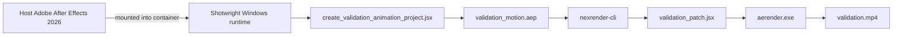

<div align="center">

# Shotwright

[简体中文](README-cn.md) | English

### Container-first Adobe After Effects runtime for AI agents

Build Windows render workers, mount a real After Effects install or auto-install from a licensed installer cache, and validate nexrender output end to end without turning designers into infrastructure operators.

<p>
	
	
	
	
	
</p>

<p>
	<a href="https://github.com/LiuChangFreeman/shotwright/stargazers">
		
	</a>
	<a href="https://github.com/LiuChangFreeman/shotwright/network/members">
		
	</a>
</p>

</div>

> [!IMPORTANT]
> Shotwright keeps After Effects at the center of the workflow. The goal is not generic AI video automation; it is reproducible AE runtime infrastructure that lets AI agents handle the repetitive execution work while designers keep taste and control.

> [!NOTE]
> In this README, installer cache means the licensed After Effects package set mounted into the container for installation.

<details>
<summary><strong>Jump to section</strong></summary>

- [Validation Demo](#-validation-demo)
- [Why Shotwright](#-why-shotwright)
- [Capabilities](#-capabilities)
- [Validation Flow](#-validation-flow)
- [Requirements](#-requirements)
- [Quick Start](#-quick-start)
- [CI And Private Installer Cache](#-ci-and-private-installer-cache)
- [Project Layout](#-project-layout)
- [Design Notes](#-design-notes)
- [Roadmap](#-roadmap)

</details>

## ✨ Validation Demo

<p align="center">
	<a href="./validation-data/output/validation.mp4">
		
	</a>
</p>

<p align="center">
	<a href="./validation-data/output/validation.mp4">
		
	</a>
</p>

The current smoke test renders a real mp4 through a Windows container, a mounted host After Effects installation, and nexrender.

| Artifact | Status | Notes |
| --- | --- | --- |
| `validation.mp4` | ✅ committed | Smoke-test render output for the current repository state |
| `validation_motion.aep` | 🟡 generated locally | Recreated during validation and intentionally excluded from Git to avoid binary churn |

## 🎬 Why Shotwright

Most AI video products reduce the creative surface area: fewer decisions, fewer controls, more templates. Shotwright makes the opposite bet.

- Give AE designers AI-agent leverage without asking them to become Windows container operators.
- Keep validation renders reproducible, replayable, and easy to audit.
- Push infrastructure into the background while creative judgment stays with the human.
- Treat After Effects as a serious runtime foundation, not a toy wrapper around a panel script.

## 🧰 Capabilities

| Capability | What it means in practice |
| --- | --- |
| Windows runtime image | Builds a container with Node.js, Python 3.13, ffmpeg, Git, and nexrender dependencies |
| Host-mount mode | Uses a real host installation of Adobe After Effects 2026 instead of packaging AE into the image |
| Installer-cache mode | Installs After Effects 26.2 inside the container from a mounted, user-supplied installer cache |
| Validation project generation | Creates a reproducible AEP from JSX so smoke tests are easy to replay |
| Patch-only JSX | Keeps validation JSX focused on composition edits while nexrender owns rendering |

## 🔄 Validation Flow



## 🧱 Requirements

- Windows host
- Docker with Windows containers enabled
- One of the following:
	- Adobe After Effects 2026 installed on the host
	- A licensed After Effects 26.2 installer cache plus the Creative Cloud helper cache

> [!IMPORTANT]
> Shotwright does not redistribute Adobe installers. Keep the installer cache in your own local storage or private artifact store.

> [!TIP]
> Proxy-aware builds are already wired through the Dockerfile via `http_proxy`, `https_proxy`, `HTTP_PROXY`, and `HTTPS_PROXY` build args.

## 🚀 Quick Start

### Step 1 — Build the Docker image

- What: Produce a Windows container image with Node.js, Python, ffmpeg, and nexrender preinstalled.
- Result: A local Docker image tagged `shotwright:dev`.
- Skip: This step is mandatory.

```powershell
docker build -t shotwright:dev .
```

The Dockerfile defaults to `AUTO_INSTALL_AFTER_EFFECTS=1`, so the container will try to install AE at startup when a mounted installer cache is present. If no installer cache is mounted, the install step is skipped quietly.

To disable auto-install explicitly:

```powershell
docker build --build-arg AUTO_INSTALL_AFTER_EFFECTS=0 -t shotwright:dev .
```

<details>
<summary><strong>Proxy-friendly build example</strong></summary>

```powershell
$proxy = 'http://192.168.1.80:8080'
docker build `
	--build-arg http_proxy=$proxy `
	--build-arg https_proxy=$proxy `
	--build-arg HTTP_PROXY=$proxy `
	--build-arg HTTPS_PROXY=$proxy `
	-t shotwright:dev .
```

</details>

### Step 2 — Run validation in host-mount mode

- What: Start a container, mount the host-side After Effects 2026 install into it, generate a test AEP, and render it through nexrender.
- Result: `validation-data/output/validation.mp4`, a 4-second H.264 mp4.
- Skip: If you only care about installer-cache mode, jump to Step 3.

```powershell
powershell -ExecutionPolicy Bypass -File .\scripts\validate\run_validation.ps1 -ImageTag shotwright:dev
```

### Step 3 — Run validation in installer-cache mode

- What: Mount a licensed installer cache into the container. The container installs After Effects automatically, then runs the same validation render as Step 2.
- Result: The same `validation-data/output/validation.mp4`.
- Skip: Optional if Step 2 already covers your validation needs.

Prepare these two directories on the host:

| Directory | Contents |
| --- | --- |
| `C:\data\payload\AEFT_26.2_win64` | `driver.xml` and all AE package folders |
| `C:\data\payload\CreativeCloudHelper_win64` | `HDBox` and `IPC` directories |

Run:

```powershell
powershell -ExecutionPolicy Bypass -File .\scripts\validate\run_validation.ps1 `
	-ImageTag shotwright:dev `
	-AfterEffectsPayloadRoot 'C:\data\payload\AEFT_26.2_win64' `
	-CreativeCloudHelperRoot 'C:\data\payload\CreativeCloudHelper_win64'
```

### Step 4 — Optional: build an installer cache from scratch

- What: Download the After Effects 26.2 installer layout from Adobe's public catalog.
- Result: `C:\data\payload\AEFT_26.2_win64` and `C:\data\payload\CreativeCloudHelper_win64`.
- Skip: Skip if you already have the required installer cache or are using host-mount mode.

```powershell
python scripts\install\download_after_effects_payload.py --payload-root C:\data\payload
```

Patch the helper installer before first use as a one-time step:

```powershell
python scripts\install\modify_setup_win.py C:\data\payload\CreativeCloudHelper_win64\HDBox\Setup.exe
```

## 🧱 CI And Private Installer Cache

The GitHub Actions workflow in `.github/workflows/windows-container-validation.yml` uses `windows-2025` runners.

- `dockerfile-build` runs on push and pull request events to confirm the image still builds.
- `validation-render` runs only on manual `workflow_dispatch` because it requires a private installer-cache archive.

Provide that archive through the `SHOTWRIGHT_INSTALLER_CACHE_URL` secret. After extraction, the archive must contain either:

- `payload/AEFT_26.2_win64` and `payload/CreativeCloudHelper_win64`
- or those two directories directly at the archive root

The repository does not link to any public Adobe installer release.

## 📁 Project Layout

```text
scripts/
	install/
		download_after_effects_payload.py       download the AE installer cache from Adobe's catalog
		download_utils.py                       Adobe catalog and download helpers
		install_after_effects_in_container.ps1  install AE from the mounted installer cache
		modify_setup_win.py                     patch Adobe helper Setup.exe
	validate/
		create_validation_animation_project.jsx  generate the test AEP
		run_validation.ps1                      manual smoke-test entrypoint
		validation_nexrender_job.json           minimal nexrender job definition
		validation_patch.jsx                    patch-only JSX used by nexrender
	runtime_entrypoint.ps1                    container startup script
	pull_mcr_image.py                         helper to pull the MCR base image behind a proxy

validation-data/
	output/                                   rendered validation artifacts
	templates/                                generated validation AEP files
	work/                                     nexrender working directories and logs
```

## 📝 Design Notes

- The Docker image does not bundle Adobe After Effects itself.
- The runtime can either mount `C:\Program Files\Adobe\Adobe After Effects 2026` from the host or install from a mounted installer cache at `C:\lab\payload`.
- Container startup runs `scripts/runtime_entrypoint.ps1`. When `AUTO_INSTALL_AFTER_EFFECTS=1` and installer-cache directories are detected, AE is installed automatically. When they are absent, installation is skipped.
- Validation JSX is patch-only by design. nexrender owns render execution and output routing.
- The validation job uses `outputExt: mp4` plus `@nexrender/action-copy` so the smoke test ends with a single predictable video artifact.

## 🗺️ Roadmap

- [ ] Add integration tests around validation command builders and recovery paths.
- [ ] Support remote worker pools for distributed render execution.
- [ ] Package arbitrary user AEP uploads into reproducible jobs.
- [ ] Add artifact retention and cleanup policies.
- [ ] Build a higher-level job model that maps designer intent to containerized execution.

## 📄 License

MIT
