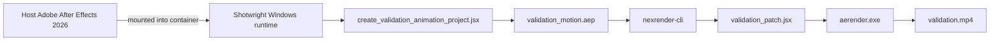

<div align="center">

# Shotwright

### Container-first Adobe After Effects runtime for AI agents

Build Windows render workers, mount a real After Effects install or auto-install from a licensed payload cache, and validate nexrender output end to end without turning designers into infrastructure operators.

<p>
	
	
	
	
	
</p>

<p>
	<a href="https://github.com/LiuChangFreeman/shotwright/stargazers">
		
	</a>
	<a href="https://github.com/LiuChangFreeman/shotwright/network/members">
		
	</a>
</p>

</div>

> [!IMPORTANT]
> Shotwright keeps After Effects at the center of the workflow. The goal is not generic AI video automation; it is reproducible AE runtime infrastructure that lets agents execute the boring parts while designers keep the taste and control.

<details>
<summary><strong>Jump to section</strong></summary>

- [Validation Demo](#-validation-demo)
- [Why Shotwright](#-why-shotwright)
- [Capabilities](#-capabilities)
- [Validation Flow](#-validation-flow)
- [Requirements](#-requirements)
- [Quick Start](#-quick-start)
- [MCP Tools](#-mcp-tools)
- [Project Layout](#-project-layout)
- [Design Notes](#-design-notes)
- [Roadmap](#-roadmap)

</details>

## ✨ Validation Demo

<p align="center">
	<a href="./validation-data/output/validation.mp4">
		
	</a>
</p>

<p align="center">
	<a href="./validation-data/output/validation.mp4">
		
	</a>
</p>

The current smoke test successfully renders a real mp4 through a Windows container, a mounted host After Effects installation, and nexrender.

| Artifact | Status | Notes |
| --- | --- | --- |
| `validation.mp4` | ✅ committed | Smoke-test render output for the current repo state |
| `validation_motion.aep` | 🟡 generated locally | Recreated during validation and intentionally kept out of Git to avoid unnecessary binary churn |

## 🎬 Why Shotwright

Most AI video products shrink the creative surface area: fewer decisions, fewer controls, more templates. Shotwright takes the opposite bet.

- Give AE designers agent leverage without asking them to become Windows container operators.
- Keep validation renders reproducible, replayable, and easy to audit.
- Make infrastructure disappear into the background while taste stays with the human.
- Treat After Effects like a serious runtime foundation, not a toy wrapper around a panel script.

The project is inspired by Dakkshin's after-effects-mcp, but the center of gravity here is different: worker runtime infrastructure first, deterministic tool execution second, and designer control throughout.

## 🧰 Capabilities

| Capability | What it means in practice |
| --- | --- |
| Windows runtime image | Builds a container with Node.js, Python 3.13, ffmpeg, Git, and nexrender dependencies |
| Host AE mount | Can use a real host installation of Adobe After Effects 2026 instead of baking AE into the image |
| Payload install mode | Can install After Effects 26.2 inside the container from a mounted, user-supplied payload cache |
| Validation project generation | Creates a reproducible AEP from JSX so smoke tests are easy to replay |
| Patch-only validation script | Keeps the JSX focused on composition edits while nexrender owns rendering |
| MCP control plane | Exposes status, validation render, and cleanup operations through deterministic tools |

## 🔄 Validation Flow



## 🧱 Requirements

- Windows host
- Docker with Windows containers enabled
- Node.js 20+
- One of the following:
	- Adobe After Effects 2026 installed on the host
	- A licensed After Effects 26.2 payload cache plus Creative Cloud helper payload

> [!IMPORTANT]
> Shotwright does not redistribute Adobe installers. Keep installer payloads in your own local cache or private artifact store.

> [!TIP]
> Proxy-aware builds are already wired through the Dockerfile via `http_proxy`, `https_proxy`, `HTTP_PROXY`, and `HTTPS_PROXY` build args.

## 🚀 Quick Start

### 1. Build the image

```powershell
docker build -t shotwright:dev -f Dockerfile .
```

The Dockerfile enables container-side After Effects installation by default with `AUTO_INSTALL_AFTER_EFFECTS=1`.

If you only want host-mount mode, disable it explicitly:

```powershell
docker build --build-arg AUTO_INSTALL_AFTER_EFFECTS=0 -t shotwright:dev -f Dockerfile .
```

<details>
<summary><strong>Proxy-friendly build example</strong></summary>

```powershell
$proxy = 'http://192.168.1.80:8080'
docker build `
	--build-arg http_proxy=$proxy `
	--build-arg https_proxy=$proxy `
	--build-arg HTTP_PROXY=$proxy `
	--build-arg HTTPS_PROXY=$proxy `
	-t shotwright:dev `
	-f Dockerfile .
```

</details>

### 2. Install dependencies and build the MCP server

```powershell
npm install
npm run build
```

### 3. Run the MCP server

```powershell
npm start
```

### 4. Run the validation render with a host AE install

```powershell
powershell -ExecutionPolicy Bypass -File .\scripts\run_validation.ps1 -ImageTag shotwright:dev
```

Expected result:

- `validation-data/templates/validation_motion.aep`
- `validation-data/output/validation.mp4`

### 5. Run the validation render with container-side installation

If you have a licensed local payload cache, mount it directly into the validation container and let the container auto-install After Effects before rendering:

```powershell
powershell -ExecutionPolicy Bypass -File .\scripts\run_validation.ps1 `
	-ImageTag shotwright:dev `
	-AfterEffectsPayloadRoot 'D:\Downloads\Adobe Downloader AEFT_26.2-ALL-win64' `
	-CreativeCloudHelperRoot 'D:\Downloads\AdobeDesktopCommon-win64'
```

Validated local result:

- `validation-data/output/validation.mp4`
- `ffprobe` reports `format_name=mov,mp4,m4a,3gp,3g2,mj2` and `duration=4.000000`

### 6. Optional: build a payload cache locally

If you need to assemble a fresh payload cache instead of pointing at an existing one, use the repository script:

```powershell
& .\.venv\Scripts\python.exe .\scripts\download_after_effects_payload.py --payload-root C:\ae-container-lab\payload
```

This produces:

- `C:\ae-container-lab\payload\AEFT_26.2_win64`
- `C:\ae-container-lab\payload\CreativeCloudHelper_win64`

Patch the helper installer before using it outside Shotwright's automatic install flow:

```powershell
& .\.venv\Scripts\python.exe .\scripts\modify_setup_win.py C:\ae-container-lab\payload\CreativeCloudHelper_win64\HDBox\Setup.exe
```

## 🧪 MCP Tools

| Tool | Purpose |
| --- | --- |
| `shotwright_status` | Report Docker, image, After Effects, and artifact readiness |
| `shotwright_render_validation` | Run the validation render end to end |
| `shotwright_cleanup_validation` | Remove the temporary validation container |
| `shotwright_download_installer_source` | Download a caller-supplied official installer URL into a local cache for a specific product/platform |

### Installer Download Interface

Shotwright can cache a user-supplied installer payload, including Windows x64 After Effects sources, without discovering vendor endpoints on its own.

- The caller must provide the full HTTPS download URL explicitly.
- Downloads are saved under `downloads/<product>/<platform>/` by default.
- Set `SHOTWRIGHT_DOWNLOAD_ROOT` to change the cache location.
- Set `SHOTWRIGHT_DOWNLOAD_ALLOWED_HOSTS` to a comma-separated allowlist if you want to restrict which hosts are accepted.

Example MCP call payload:

```json
{
	"sourceUrl": "https://example.invalid/After_Effects_Installer.zip",
	"product": "after-effects",
	"platform": "windows-x64",
	"destinationFileName": "After_Effects_Installer.zip",
	"overwrite": false
}
```

## 🧱 Installer Cache And CI

The GitHub Actions workflow in `.github/workflows/windows-container-validation.yml` uses `windows-2025` runners to validate that the Dockerfile still builds.

If you want CI to run the full install-and-render path, provide a private zip cache through the `SHOTWRIGHT_INSTALLER_CACHE_URL` secret. The zip must expand to either:

- `payload/AEFT_26.2_win64` and `payload/CreativeCloudHelper_win64`
- or those two directories at the archive root

The repository intentionally does not point to a public Adobe installer release.

## 📁 Project Layout

```text
src/
	config.ts                runtime configuration loader
	index.ts                 MCP server entrypoint
	shell.ts                 subprocess helpers for Docker and PowerShell
	validation.ts            validation orchestration and artifact checks

scripts/
	create_validation_animation_project.jsx   generates the mock animated AEP
	download_after_effects_payload.py         downloads a local payload cache layout
	install_after_effects_in_container.ps1    installs AE inside the container from mounted payloads
	modify_setup_win.py                       patches the Windows helper installer binary
	runtime_entrypoint.ps1                    auto-installs AE on container startup when payloads exist
	validation_patch.jsx                      patch-only JSX used by nexrender
	validation_nexrender_job.json             minimal nexrender job definition
	run_validation.ps1                        manual smoke-test entrypoint

validation-data/
	output/                  rendered validation artifacts
	templates/               generated validation AEP files
	work/                    nexrender working directories and logs
```

## 📝 Design Notes

- The Docker image does not bundle Adobe After Effects itself.
- The runtime can either mount `C:\Program Files\Adobe\Adobe After Effects 2026` from the host or install from a mounted payload cache at `C:\lab\payload`.
- Container startup runs `scripts/runtime_entrypoint.ps1`, and `AUTO_INSTALL_AFTER_EFFECTS=1` is enabled by default.
- Validation JSX is patch-only by design. nexrender owns output naming and render execution.
- The validation job intentionally uses `outputExt: mp4` and `@nexrender/action-copy` so the smoke test ends with a single predictable video artifact.

## 🗺️ Roadmap

- [ ] add integration tests around the command builders in `src/validation.ts`
- [ ] add remote worker pool support
- [ ] add job packaging for arbitrary AEP uploads
- [ ] add artifact retention and cleanup policies
- [ ] add a higher-level natural-language job model that maps designer intent to containerized execution

## 📄 License

MIT
