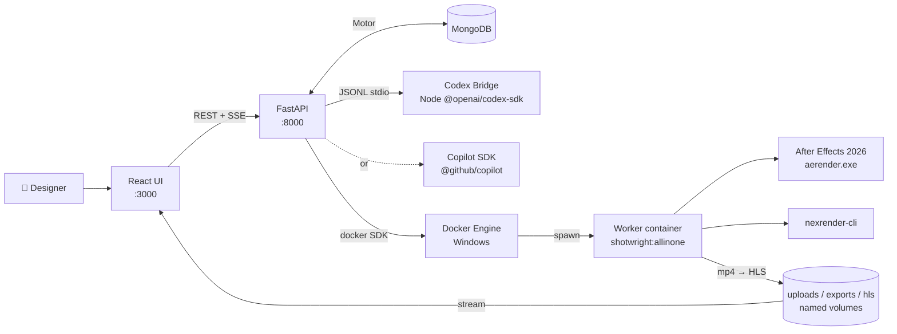

<div align="center">

# Shotwright

[简体中文](README-cn.md) | English

### Container-first After Effects runtime — driven by an AI agent

A chat-driven product where a Copilot or Codex agent operates real Adobe After Effects inside a Windows container. Drop in a reference video, narrate the intent, and watch the agent storyboard the footage, stage assets, write JSX, drive nexrender, and stream the rendered mp4 back to the browser — without asking designers to become Windows container operators.

<p>
	
	
	
	
	
	
	
</p>

<p>
	<a href="https://github.com/machinepulse-ai/shotwright/stargazers">
		
	</a>
	<a href="https://github.com/machinepulse-ai/shotwright/network/members">
		
	</a>
</p>

</div>

> [!IMPORTANT]
> Shotwright keeps After Effects at the center. The goal is **not** generic AI video automation — it is reproducible AE runtime infrastructure plus an agent shell, so designers keep taste and control while the system handles configuration, file plumbing, JSX, render queueing, and review loops.

> [!NOTE]
> Shared defaults — host/container paths, runner temp directory names, base image tags, nexrender package versions — live in [shotwright-config.json](shotwright-config.json). [setup-versions.yml](setup-versions.yml) is the source of truth for the selected After Effects version. The bundled AE setup payload is published to GHCR and copied into `shotwright:allinone` at image-build time.

<details>
<summary><strong>Jump to section</strong></summary>

- [Validation Demo](#-validation-demo)
- [Why Shotwright](#-why-shotwright)
- [What's Inside](#-whats-inside)
- [Architecture](#-architecture)
- [Agent Tools](#-agent-tools)
- [Quick Start](#-quick-start)
- [AE Runtime Container](#-ae-runtime-container)
- [CI and GHCR Setup Images](#-ci-and-ghcr-setup-images)
- [Project Layout](#-project-layout)
- [Skills Bundle](#-skills-bundle)
- [Design Notes](#-design-notes)
- [Roadmap](#-roadmap)

</details>

## ✨ Validation Demo

<p align="center">
	
</p>

The GIF is a short looping cut from a real `validation.mp4`. The smoke render exercises every layer of the stack — a Windows container starts the all-in-one image, AE 26.2 boots, nexrender resolves a JSX patch, `aerender.exe` produces an H.264 mp4, and the file is copied to `validation-data/output/`.

| Artifact | Status | Notes |
| --- | --- | --- |
| `validation-preview.gif` | ✅ committed | 4-second looping README demo asset cut from `validation.mp4` |
| `validation.mp4` | 🟡 generated locally | Smoke-test render produced during validation runs |
| `validation_motion.aep` | 🟡 generated locally | Regenerated each run; excluded from Git to avoid binary churn |

## 🎬 Why Shotwright

Most AI video products shrink the creative surface area: fewer decisions, fewer controls, more templates. Shotwright bets the other way.

- Give AE designers AI-agent leverage without asking them to become Windows container operators.
- Keep renders reproducible, replayable, and auditable — JSX, nexrender job specs, and mp4 outputs are first-class artifacts.
- Push infrastructure into the background. Creative judgment stays with the human; the loop is `intent → agent → JSX → render → review`.
- Treat After Effects as a serious runtime foundation, not a thin wrapper around a panel script.

## 🧭 What's Inside

Three cooperating layers, all running on Windows Server LTSC 2025:

| Layer | Stack | Responsibility |
| --- | --- | --- |
| **Web UI** | React 18 + TypeScript + Webpack 5 | Chat console (AgentPanel), admin (AdminPanel), HLS player (VideoPlayer), container manager |
| **Agent runtime** | FastAPI · Motor (MongoDB) · Codex SDK bridge **or** Copilot SDK | Session/project/container state, agent tool dispatch, SSE streaming, REST API |
| **AE runtime worker** | Windows container · AE 26.2 · nexrender · ffmpeg · Python 3.13 · Node 20 | Executes JSX patches, drives `aerender.exe`, encodes mp4, returns artifacts |

The default Docker image is `shotwright:allinone` — backend, frontend toolchain, AE setup payload, nexrender, and worker scripts in a single Windows image.

## 🏗️ Architecture



Same physical Docker engine hosts MongoDB, backend, frontend, and on-demand AE worker containers. The backend talks to the local Docker named pipe (`\\.\pipe\docker_engine`) to start a worker container per session and tear it down when idle.

## 🧰 Agent Tools

The agent has 16 custom tools registered in [`agent_tools.py`](src/backend/app/services/agent_tools.py). They map onto a four-phase workflow:

| Phase | Tools |
| --- | --- |
| **Workspace & container lifecycle** | `ensure_after_effects_container` · `inspect_workspace` · `stop_after_effects_container` |
| **Project lifecycle** | `create_after_effects_project` · `create_empty_after_effects_project` · `list_uploaded_projects` · `select_active_project` · `export_project_archive` |
| **Reference & asset prep** | `stage_reference_images` · `generate_storyboard_from_reference_video` · `generate_tts_audio` · `run_python_code` *(Pillow / data prep in a managed venv)* |
| **AE composition, render & review** | `create_reference_composition` · `create_lyrics_mv_project` · `run_after_effects_jsx` · `render_after_effects_project` |

`run_python_code` runs in a sandboxed venv synced from `src/backend-config/requirements-aigc.txt`, so the agent can generate PIL assets, prep numpy/scipy data, and call Pillow without ever leaving the worker container.

## 🚀 Quick Start

### A. Run the platform (Docker Compose)

```powershell
cd src
copy .env.example .env
# edit .env — set SHOTWRIGHT_SECRET_KEY and SHOTWRIGHT_ADMIN_PASSWORD

# build worker image once (default target = shotwright:allinone)
docker build --target shotwright -t shotwright:allinone .

# start the platform: mongo + backend + frontend
.\scripts\deploy.ps1 -Build -Detach

# or dev mode (hot-reload backend + webpack-dev-server)
.\scripts\deploy.ps1 -Dev -Build
```

| Service | URL |
| --- | --- |
| Frontend | http://localhost:3000 |
| Backend API | http://localhost:8000/api |
| Swagger | http://localhost:8000/api/docs |

### B. Local dev without Docker

Requires a local MongoDB on `localhost:27017` and an AE-capable Windows host if you want to exercise the worker container.

```powershell
# backend (FastAPI + Codex bridge)
cd src/backend
uv sync
uv run uvicorn app.main:app --reload --port 8000

# frontend (React + webpack-dev-server)
cd src/frontend
npm install
npm run dev
```

Or the convenience one-shot: `.\src\scripts\dev.ps1`.

### C. Validate the AE runtime container only

Useful when you only want to verify the Windows container, AE install, and nexrender round-trip — no platform required.

```powershell
powershell -ExecutionPolicy Bypass -File .\scripts\validate\run_validation.ps1 -ImageTag shotwright:allinone
```

Produces `validation-data/output/validation.mp4`. See [AE Runtime Container](#-ae-runtime-container) below for host-mount and installer-cache variants, plus [setup.md](setup.md) for the full installer-cache walkthrough.

## 🪟 AE Runtime Container

The root [Dockerfile](Dockerfile) is multi-stage. The default `shotwright` target bakes the AE installer payload (pulled from GHCR at build time) directly into the image.

| Stage | Purpose | Typical tag |
| --- | --- | --- |
| `base` | Shared toolchain — choco, Node 20, Python 3.13, ffmpeg, git, vcredist | — |
| `after-effects-setup` | Reference to `ghcr.io/liuchangfreeman/shotwright/after-effects-setup:26.2` | (pulled, not built) |
| `shotwright` | All-in-one AE worker — installs AE during build, runs `runtime_entrypoint.ps1` at startup | `shotwright:allinone` |
| `backend` | FastAPI + codex-bridge + uv dependencies | `shotwright:backend` |
| `frontend-build` → `frontend` | Webpack production build + static server | `shotwright:frontend` |

### Three runtime modes for AE

| Mode | When to use | How |
| --- | --- | --- |
| **All-in-one (default)** | Most users; service-spawned worker containers | `docker build --target shotwright -t shotwright:allinone .` — AE is baked in at build time |
| **Host-mount** | You already have AE installed on the Windows host and want a thinner image | Pass `-AfterEffectsPayloadRoot $null` to `run_validation.ps1`; the script mounts the host install resolved from `setup-versions.yml` |
| **Installer-cache** | Air-gapped or proxy-restricted builds; want to control payload provenance | Pull or build a payload directory, then pass `-AfterEffectsPayloadRoot` and `-CreativeCloudHelperRoot` to `run_validation.ps1`. Detailed walkthrough in [setup.md](setup.md) |

<details>
<summary><strong>Proxy-friendly build example</strong></summary>

```powershell
$proxy = 'http://proxy.example.com:8080'
docker build `
	--build-arg http_proxy=$proxy `
	--build-arg https_proxy=$proxy `
	--build-arg HTTP_PROXY=$proxy `
	--build-arg HTTPS_PROXY=$proxy `
	--target shotwright `
	-t shotwright:allinone .
```

</details>

<details>
<summary><strong>Disable the AE re-check at container startup</strong></summary>

```powershell
docker build --target shotwright --build-arg AUTO_INSTALL_AFTER_EFFECTS=0 -t shotwright:allinone .
```

</details>

### Requirements

- Windows host (Windows 11 Pro or Windows Server LTSC 2025)
- Docker Desktop in Windows-container mode (`docker info --format '{{.OSType}}'` returns `windows`)
- For the host-mount path only: a real AE install matching the `setup-versions.yml` selection

## 🔁 CI and GHCR Setup Images

Workflows in `.github/workflows/` target `windows-2025` runners.

| Workflow | Trigger | Purpose |
| --- | --- | --- |
| `ae-setup-publish` | Push to `setup-versions.yml` or manual dispatch | Download AE installer from Adobe, patch helper `Setup.exe`, publish to `ghcr.io/liuchangfreeman/shotwright/after-effects-setup:<version>` |
| `windows-container-validation` — `dockerfile-build` | Push or PR touching `Dockerfile` | Build verification for `shotwright:allinone` |
| `windows-container-validation` — `validation-render` | Manual `workflow_dispatch` | Pull installer payload from GHCR and run the full validation render |

`ae-setup-publish` packages everything into a `nanoserver:ltsc2025` image, which `shotwright:allinone` later pulls from at build time. No private secrets are needed beyond the default `GITHUB_TOKEN`.

## 📁 Project Layout

```text
.
├── src/                              full-stack platform (run via docker compose)
│   ├── backend/                      FastAPI + MongoDB + agent runtime
│   │   ├── app/
│   │   │   ├── main.py               FastAPI entrypoint
│   │   │   ├── config.py             pydantic-settings config
│   │   │   ├── database.py           Motor client + cache/session abstractions
│   │   │   ├── models/               Pydantic models (session, project, container, chat, media, admin, agent)
│   │   │   ├── routers/              sessions / projects / containers / agent / admin / streaming
│   │   │   ├── middleware/           admin JWT auth
│   │   │   └── services/             agent_tools, codex_bridge, codex_runtime, copilot_runtime,
│   │   │                             container_manager, nexrender, reference_media, tts,
│   │   │                             image_attachments, video_streaming, project_manager, …
│   │   └── codex-bridge/             Node JSONL bridge for @openai/codex-sdk
│   ├── frontend/                     React 18 + TS + Webpack 5
│   │   └── src/components/{AgentPanel,AdminPanel,VideoPlayer,ContainerManager}
│   ├── docker-compose.yml            production stack (mongo + backend + frontend)
│   ├── docker-compose.dev.yml        hot-reload overlay
│   ├── docker-compose.local-codex.yml  optional override for local Codex CLI auth
│   └── scripts/                      deploy.ps1 · dev.ps1 · cleanup.ps1 · runtime_smoke.py
├── scripts/                          worker-side runtime + validation
│   ├── runtime_entrypoint.ps1        container startup (AE re-check + bridge boot)
│   ├── pull_container_image.py       proxy-friendly OCI image downloader
│   ├── install/                      AE installer cache, version reader, modify_setup_win.py
│   └── validate/                     create_validation_animation_project.jsx · validation_patch.jsx
│                                     validation_nexrender_job.json · run_validation.ps1
├── Dockerfile                        multi-stage: base / after-effects-setup / shotwright / backend / frontend
├── shotwright-config.json            shared host/container path and tooling defaults
├── setup-versions.yml                selected AE version (drives ae-setup-publish + install_root)
├── validation-data/                  output/, templates/, work/ — generated locally
└── docs/                             README assets (validation-preview.gif, setup-source-comparison.svg)
```

## 🧠 Skills Bundle

Shotwright keeps Copilot skills only under `.github/skills`. That directory stays out of Git and is hydrated from a versioned release bundle whenever the repository startup path detects it is missing. Manual bootstrap:

```powershell
python .\scripts\skills\download_skills_bundle.py
```

To edit and re-publish: change files under `.github/skills`, bump `tooling.skills.artifactVersion` in [shotwright-config.json](shotwright-config.json), then:

```powershell
python .\scripts\skills\package_skills_bundle.py
python .\scripts\skills\publish_skills_release.py
```

## 📝 Design Notes

- **Image strategy.** The default worker image is `shotwright:allinone`. Service-created worker containers and `docker-compose.dev.yml` both start from this preinstalled image; the older split between `shotwright:dev` and a separate runtime is gone.
- **Patch-only JSX.** Validation JSX is patch-only on purpose. nexrender owns render execution and output routing — the validation script also recovers a stray `result.mp4` from the work directory when AE returns a non-zero exit code.
- **Single predictable artifact.** Validation jobs use `outputExt: mp4` + `@nexrender/action-copy`, so each run ends with one mp4 (no `.done` markers).
- **Agent providers.** The agent provider is pluggable. `SHOTWRIGHT_AGENT_PROVIDER=copilot` (default) uses the GitHub Copilot SDK; `=codex` routes turns through the in-container Node Codex bridge. Both keys can coexist; admins switch in the AdminPanel.
- **Sandboxed Python tool.** `run_python_code` runs in a managed venv (`SHOTWRIGHT_PYTHON_TOOL_RUNTIME_DIR`) hashed from `requirements-aigc.txt`, so the agent never installs into the system interpreter.
- **HLS streaming.** Render outputs are sliced into HLS segments and served from the shared `hls` volume; the React `VideoPlayer` component plays them with `hls.js`.

## 🗺️ Roadmap

- [ ] Remote worker pools for distributed render execution
- [ ] Multi-tenant project isolation + per-user quotas
- [ ] First-class artifact retention and cleanup policies
- [ ] Higher-level job model that maps designer intent to containerized execution
- [ ] Integration tests for validation command builders and recovery paths
- [ ] Public Helm chart (compose labels already follow `app.kubernetes.io/*` convention)

## 📄 License

MIT
