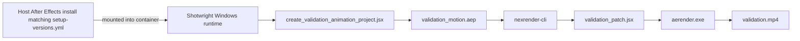

<div align="center">

# Shotwright

[简体中文](README-cn.md) | English

### Container-first Adobe After Effects runtime for AI agents

Build Windows render workers, mount a real After Effects install or auto-install from a GHCR-hosted or locally prepared installer cache, and validate nexrender output end to end without turning designers into infrastructure operators.

<p>
	
	
	
	
	
</p>

<p>
	<a href="https://github.com/LiuChangFreeman/shotwright/stargazers">
		
	</a>
	<a href="https://github.com/LiuChangFreeman/shotwright/network/members">
		
	</a>
</p>

</div>

> [!IMPORTANT]
> Shotwright keeps After Effects at the center of the workflow. The goal is not generic AI video automation; it is reproducible AE runtime infrastructure that lets AI agents handle the repetitive execution work while designers keep taste and control.

> [!NOTE]
> In this README, installer cache means the After Effects package set used for container installation, either pulled from GHCR or prepared locally. Shared defaults such as host and container paths, runner temp subdirectory names, base image tags, and nexrender package versions now live in [shotwright-config.json](shotwright-config.json). `setup-versions.yml` remains the source of truth for the selected AE setup version.

<details>
<summary><strong>Jump to section</strong></summary>

- [Validation Demo](#-validation-demo)
- [Why Shotwright](#-why-shotwright)
- [Capabilities](#-capabilities)
- [Validation Flow](#-validation-flow)
- [Requirements](#-requirements)
- [Quick Start](#-quick-start)
- [CI And GHCR Setup Images](#-ci-and-ghcr-setup-images)
- [Project Layout](#-project-layout)
- [Design Notes](#-design-notes)
- [Roadmap](#-roadmap)

</details>

## ✨ Validation Demo

<p align="center">
	
</p>

The GIF above is a short looping repository preview cut from the validation mp4. The smoke test itself still renders a real mp4 through a Windows container, a mounted host After Effects installation, and nexrender.

| Artifact | Status | Notes |
| --- | --- | --- |
| `validation-preview.gif` | ✅ committed | 4-second looping README demo asset derived from `validation.mp4` |
| `validation.mp4` | 🟡 generated locally | Smoke-test render output produced during validation runs |
| `validation_motion.aep` | 🟡 generated locally | Recreated during validation and intentionally excluded from Git to avoid binary churn |

## 🎬 Why Shotwright

Most AI video products reduce the creative surface area: fewer decisions, fewer controls, more templates. Shotwright makes the opposite bet.

- Give AE designers AI-agent leverage without asking them to become Windows container operators.
- Keep validation renders reproducible, replayable, and easy to audit.
- Push infrastructure into the background while creative judgment stays with the human.
- Treat After Effects as a serious runtime foundation, not a toy wrapper around a panel script.

## 🧰 Capabilities

| Capability | What it means in practice |
| --- | --- |
| Windows runtime image | Builds a container with Node.js, Python 3.13, ffmpeg, Git, and nexrender dependencies |
| Host-mount mode | Uses the host After Effects install that matches the version selected in `setup-versions.yml` instead of packaging AE into the image |
| Installer-cache mode | Installs the setup version selected in `setup-versions.yml` inside the container from a GHCR-hosted or locally prepared installer cache |
| Validation project generation | Creates a reproducible AEP from JSX so smoke tests are easy to replay |
| Patch-only JSX | Keeps validation JSX focused on composition edits while nexrender owns rendering |

## 🔄 Validation Flow



## 🧱 Requirements

- Windows host
- Docker with Windows containers enabled
- One of the following:
	- Adobe After Effects matching the current `setup-versions.yml` selection installed on the host
	- An installer payload obtained with the GHCR-first workflow in Step 3

> [!TIP]
> Pre-built installer payload images are published to GHCR, and proxy-aware builds are already wired through the Dockerfile via `http_proxy`, `https_proxy`, `HTTP_PROXY`, and `HTTPS_PROXY` build args. See [setup-versions.yml](setup-versions.yml) for available versions.

## 🚀 Quick Start

### Step 1 — Build the Docker image

- What: Produce the all-in-one Windows worker image with Node.js, Python, ffmpeg, nexrender, and the selected After Effects install baked in.
- Result: A local Docker image tagged `shotwright:allinone`.
- Skip: This step is mandatory.

```powershell
docker build --target shotwright -t shotwright:allinone .
```

The Dockerfile now copies the published `ghcr.io/liuchangfreeman/shotwright/after-effects-setup:26.2` payload into the all-in-one image and runs `install_after_effects_in_container.ps1` during image build. Worker containers and the development service therefore start from the same preinstalled `shotwright:allinone` image without a separate payload-mount workflow.

To disable the startup re-check explicitly:

```powershell
docker build --target shotwright --build-arg AUTO_INSTALL_AFTER_EFFECTS=0 -t shotwright:allinone .
```

<details>
<summary><strong>Proxy-friendly build example</strong></summary>

```powershell
$proxy = 'http://proxy.example.com:8080'
docker build `
	--build-arg http_proxy=$proxy `
	--build-arg https_proxy=$proxy `
	--build-arg HTTP_PROXY=$proxy `
	--build-arg HTTPS_PROXY=$proxy `
	--target shotwright `
	-t shotwright:allinone .
```

</details>

### Step 2 — Run validation in host-mount mode

- What: Start a container, mount the host-side After Effects install selected by `setup-versions.yml`, generate a test AEP, and render it through nexrender.
- Result: `validation-data/output/validation.mp4`, a 4-second H.264 mp4.
- Skip: If you only care about installer-cache mode, jump to Step 3.

```powershell
powershell -ExecutionPolicy Bypass -File .\scripts\validate\run_validation.ps1 -ImageTag shotwright:allinone
```

### Step 3 — Run validation in installer-cache mode

- What: Resolve the active setup version from `setup-versions.yml`, then obtain the installer cache from GHCR first or the local downloader as a fallback.
- Result: A payload directory aligned with the repo's selected setup version, then the same `validation-data/output/validation.mp4`.
- Skip: Optional if Step 2 already covers your validation needs.

Resolve the active setup version once. The helper reads `setup-versions.yml`, so the rest of the commands stay aligned with the repo's current selection:

```powershell
$setup = python .\scripts\install\setup_versions.py | ConvertFrom-Json
```

The same object also exposes `$setup.install_root`, which is the expected AE install directory for the selected version.

<p align="center">
	
</p>

Preferred path — pull the installer payload from GHCR and extract it:

```powershell
docker pull $setup.ghcr_image
docker create --name ae-setup $setup.ghcr_image cmd /c exit
docker cp 'ae-setup:C:\payload' 'C:\data\payload'
docker rm ae-setup
```

> [!IMPORTANT]
> Windows setup images are large. If `docker pull` stalls or times out, use `scripts/pull_container_image.py` instead. It downloads through `http_proxy` or `https_proxy`, writes a local docker archive, and can `docker load` it for you:
>
> ```powershell
> python .\scripts\pull_container_image.py --image $setup.ghcr_image --output-dir C:\data\images --load
> ```

Fallback path — build the installer cache locally:

```powershell
python .\scripts\install\download_after_effects_payload.py --payload-root C:\data\payload
$helperSetup = Join-Path (Join-Path 'C:\data\payload' $setup.helper_dir_name) 'HDBox\Setup.exe'
python .\scripts\install\modify_setup_win.py $helperSetup
```

Run:

```powershell
powershell -ExecutionPolicy Bypass -File .\scripts\validate\run_validation.ps1 `
	-ImageTag shotwright:allinone `
	-AfterEffectsPayloadRoot (Join-Path 'C:\data\payload' $setup.payload_dir_name) `
	-CreativeCloudHelperRoot (Join-Path 'C:\data\payload' $setup.helper_dir_name)
```

## 🧱 CI And GHCR Setup Images

The GitHub Actions workflows in `.github/workflows/` use `windows-2025` runners.

| Workflow | Trigger | Purpose |
| --- | --- | --- |
| `ae-setup-publish` | Push to `setup-versions.yml` or manual dispatch | Download AE installer from Adobe, patch, and publish to GHCR |
| `windows-container-validation` — `dockerfile-build` | Push or PR to `Dockerfile` | Confirm the Shotwright image builds |
| `windows-container-validation` — `validation-render` | Manual `workflow_dispatch` | Pull installer payload from GHCR, run full validation |

The `ae-setup-publish` workflow reads [setup-versions.yml](setup-versions.yml) to determine which After Effects version to build. It downloads the installer payload from Adobe's public catalog, patches the helper `Setup.exe`, packages everything into a `nanoserver:ltsc2025` container image, and pushes it to GHCR.

The `validation-render` job pulls the setup image from GHCR and extracts the payload automatically. No private secrets are required beyond the default `GITHUB_TOKEN`.

## 📁 Project Layout

```text
scripts/
	install/
		download_after_effects_payload.py       download the AE installer cache from Adobe's catalog
		download_utils.py                       Adobe catalog and download helpers
		install_after_effects_in_container.ps1  install AE from the mounted installer cache
		modify_setup_win.py                     patch Adobe helper Setup.exe
		setup_versions.py                       read the active setup version and derived paths from setup-versions.yml
	validate/
		create_validation_animation_project.jsx  generate the test AEP
		run_validation.ps1                      manual smoke-test entrypoint
		validation_nexrender_job.json           minimal nexrender job definition
		validation_patch.jsx                    patch-only JSX used by nexrender
	runtime_entrypoint.ps1                    container startup script
	pull_container_image.py                   proxy-friendly image downloader for GHCR, MCR, and other OCI registries

validation-data/
	output/                                   rendered validation artifacts
	templates/                                generated validation AEP files
	work/                                     nexrender working directories and logs
```

## 🧠 Skills Bundle Maintenance

Shotwright keeps Copilot skills only in `.github/skills`. That directory stays out of Git and is hydrated from the versioned release bundle whenever the repository startup path or development entrypoints detect that it is missing.

Manually bootstrap or refresh the repo-local skills directory when needed:

```powershell
python .\scripts\skills\download_skills_bundle.py
```

Then edit files under `.github/skills`, bump `tooling.skills.artifactVersion` in [shotwright-config.json](shotwright-config.json), package the updated bundle, and publish it:

```powershell
python .\scripts\skills\package_skills_bundle.py
python .\scripts\skills\publish_skills_release.py
```

## 📝 Design Notes

- The default worker image is `shotwright:allinone`, which copies the published GHCR setup payload into the image, installs the `setup-versions.yml` selection during image build, and includes the backend/frontend development toolchain.
- Validation can still exercise host-mount and installer-cache flows explicitly, but service-created worker containers and the development service now default to the same preinstalled image.
- Container startup still runs `scripts/runtime_entrypoint.ps1`. When `aerender.exe` is already present, the shared installer path returns immediately.
- Validation JSX is patch-only by design. nexrender owns render execution and output routing.
- The validation job uses `outputExt: mp4` plus `@nexrender/action-copy` so the smoke test ends with a single predictable video artifact.

## 🗺️ Roadmap

- [ ] Add integration tests around validation command builders and recovery paths.
- [ ] Support remote worker pools for distributed render execution.
- [ ] Package arbitrary user AEP uploads into reproducible jobs.
- [ ] Add artifact retention and cleanup policies.
- [ ] Build a higher-level job model that maps designer intent to containerized execution.

## 📄 License

MIT
