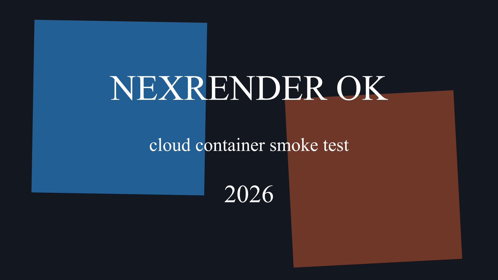
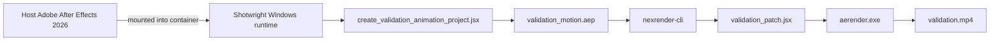

<div align="center">

# Shotwright

[简体中文](README-cn.md) | English

### Container-first Adobe After Effects runtime for AI agents

Build Windows render workers, mount a real After Effects install or auto-install from a licensed payload cache, and validate nexrender output end to end — without turning designers into infrastructure operators.

<p>
	
	
	
	
	
</p>

<p>
	<a href="https://github.com/LiuChangFreeman/shotwright/stargazers">
		
	</a>
	<a href="https://github.com/LiuChangFreeman/shotwright/network/members">
		
	</a>
</p>

</div>

> [!IMPORTANT]
> Shotwright keeps After Effects at the center of the workflow. The goal is not generic AI video automation; it is reproducible AE runtime infrastructure that lets agents execute the boring parts while designers keep the taste and control.

<details>
<summary><strong>Jump to section</strong></summary>

- [Validation Demo](#-validation-demo)
- [Why Shotwright](#-why-shotwright)
- [Capabilities](#-capabilities)
- [Validation Flow](#-validation-flow)
- [Requirements](#-requirements)
- [Quick Start](#-quick-start)
- [Project Layout](#-project-layout)
- [Design Notes](#-design-notes)
- [Roadmap](#-roadmap)

</details>

## ✨ Validation Demo

<p align="center">
	<a href="./validation-data/output/validation.mp4">
		
	</a>
</p>

<p align="center">
	<a href="./validation-data/output/validation.mp4">
		
	</a>
</p>

The current smoke test successfully renders a real mp4 through a Windows container, a mounted host After Effects installation, and nexrender.

| Artifact | Status | Notes |
| --- | --- | --- |
| `validation.mp4` | ✅ committed | Smoke-test render output for the current repo state |
| `validation_motion.aep` | 🟡 generated locally | Recreated during validation and intentionally kept out of Git to avoid unnecessary binary churn |

## 🎬 Why Shotwright

Most AI video products shrink the creative surface area: fewer decisions, fewer controls, more templates. Shotwright takes the opposite bet.

- Give AE designers agent leverage without asking them to become Windows container operators.
- Keep validation renders reproducible, replayable, and easy to audit.
- Make infrastructure disappear into the background while taste stays with the human.
- Treat After Effects like a serious runtime foundation, not a toy wrapper around a panel script.

## 🧰 Capabilities

| Capability | What it means in practice |
| --- | --- |
| Windows runtime image | Builds a container with Node.js, Python 3.13, ffmpeg, Git, and nexrender dependencies |
| Host AE mount | Can use a real host installation of Adobe After Effects 2026 instead of baking AE into the image |
| Payload install mode | Can install After Effects 26.2 inside the container from a mounted, user-supplied payload cache |
| Validation project generation | Creates a reproducible AEP from JSX so smoke tests are easy to replay |
| Patch-only validation script | Keeps the JSX focused on composition edits while nexrender owns rendering |

## 🔄 Validation Flow



## 🧱 Requirements

- Windows host
- Docker with Windows containers enabled
- One of the following:
	- Adobe After Effects 2026 installed on the host
	- A licensed After Effects 26.2 payload cache plus Creative Cloud helper payload

> [!IMPORTANT]
> Shotwright does not redistribute Adobe installers. Keep installer payloads in your own local cache or private artifact store.

> [!TIP]
> Proxy-aware builds are already wired through the Dockerfile via `http_proxy`, `https_proxy`, `HTTP_PROXY`, and `HTTPS_PROXY` build args.

## 🚀 Quick Start

### Step 1 — Build the Docker image

**What**: Produce a Windows container image with Node.js, Python, ffmpeg, and nexrender pre-installed.
**Result**: A local Docker image tagged `shotwright:dev`.
**Skip**: You cannot skip this step. The image is the foundation for all subsequent steps.

```powershell
docker build -t shotwright:dev .
```

The Dockerfile defaults to `AUTO_INSTALL_AFTER_EFFECTS=1`, meaning the container will attempt to install AE from a mounted payload at startup. If no payload is mounted, the install step is silently skipped.

To explicitly disable auto-install:

```powershell
docker build --build-arg AUTO_INSTALL_AFTER_EFFECTS=0 -t shotwright:dev .
```

<details>
<summary><strong>Proxy-friendly build example</strong></summary>

```powershell
$proxy = 'http://192.168.1.80:8080'
docker build `
	--build-arg http_proxy=$proxy `
	--build-arg https_proxy=$proxy `
	--build-arg HTTP_PROXY=$proxy `
	--build-arg HTTPS_PROXY=$proxy `
	-t shotwright:dev .
```

</details>

### Step 2 — Run the validation render (host AE mode)

**What**: Start a container, mount the host After Effects 2026 into it, generate a test AEP, and render it through nexrender.
**Result**: `validation-data/output/validation.mp4` — a 4-second H.264 mp4.
**Skip**: If you only want to use payload-install mode, jump to Step 3.

```powershell
powershell -ExecutionPolicy Bypass -File .\scripts\validate\run_validation.ps1 -ImageTag shotwright:dev
```

### Step 3 — Run the validation render (payload install mode)

**What**: Mount a licensed payload cache into the container. The container auto-installs After Effects, then runs the same validation render as Step 2.
**Result**: Same `validation-data/output/validation.mp4`.
**Skip**: If you already validated with a host AE install (Step 2), this step is optional.

Prepare two directories on the host:

| Directory | Contents |
| --- | --- |
| `C:\data\payload\AEFT_26.2_win64` | `driver.xml` and all AE package folders |
| `C:\data\payload\CreativeCloudHelper_win64` | `HDBox` and `IPC` directories |

Run:

```powershell
powershell -ExecutionPolicy Bypass -File .\scripts\validate\run_validation.ps1 `
	-ImageTag shotwright:dev `
	-AfterEffectsPayloadRoot 'C:\data\payload\AEFT_26.2_win64' `
	-CreativeCloudHelperRoot 'C:\data\payload\CreativeCloudHelper_win64'
```

### Step 4 — (Optional) Build a payload cache from scratch

**What**: Download the After Effects 26.2 installer layout using Adobe's public catalog. This is only needed if you don't already have the payload directories.
**Result**: `C:\data\payload\AEFT_26.2_win64` and `C:\data\payload\CreativeCloudHelper_win64`.
**Skip**: If you already have a local payload cache or are using host-mount mode.

```powershell
python scripts\install\download_after_effects_payload.py --payload-root C:\data\payload
```

Patch the helper installer before first use (one-time operation):

```powershell
python scripts\install\modify_setup_win.py C:\data\payload\CreativeCloudHelper_win64\HDBox\Setup.exe
```

## 🧱 Installer Cache And CI

The GitHub Actions workflow in `.github/workflows/windows-container-validation.yml` uses `windows-2025` runners to validate that the Dockerfile still builds on push/PR.

The full install-and-render path only runs on `workflow_dispatch` because it needs a private payload zip. Provide it through the `SHOTWRIGHT_INSTALLER_CACHE_URL` secret. The zip must expand to:

- `payload/AEFT_26.2_win64` and `payload/CreativeCloudHelper_win64`
- or those two directories at the archive root

The repository does not point to any public Adobe installer release.

## 📁 Project Layout

```text
scripts/
	install/
		download_after_effects_payload.py    download AE payload from Adobe catalog
		download_utils.py                    Adobe installer catalog and download helpers
		install_after_effects_in_container.ps1  install AE from mounted payloads
		modify_setup_win.py                  patch Adobe helper Setup.exe binary
	validate/
		create_validation_animation_project.jsx  generate the mock animated AEP
		run_validation.ps1                   manual smoke-test entrypoint
		validation_nexrender_job.json        minimal nexrender job definition
		validation_patch.jsx                 patch-only JSX used by nexrender
	runtime_entrypoint.ps1    container startup script (auto-install + keepalive)
	pull_mcr_image.py         helper to pull MCR base image through proxy

validation-data/
	output/                   rendered validation artifacts
	templates/                generated validation AEP files
	work/                     nexrender working directories and logs
```

## 📝 Design Notes

- The Docker image does not bundle Adobe After Effects itself.
- The runtime can either mount `C:\Program Files\Adobe\Adobe After Effects 2026` from the host, or install from a mounted payload cache at `C:\lab\payload`.
- Container startup runs `scripts/runtime_entrypoint.ps1`. When `AUTO_INSTALL_AFTER_EFFECTS=1` (the default) and payload directories are detected, AE is installed automatically. When payloads are absent, install is silently skipped.
- Validation JSX is patch-only by design. nexrender owns output naming and render execution.
- The validation job uses `outputExt: mp4` and `@nexrender/action-copy` so the smoke test ends with a single predictable video artifact.

## 🗺️ Roadmap

- [ ] Integration tests around the validation command builders
- [ ] Remote worker pool support
- [ ] Job packaging for arbitrary AEP uploads
- [ ] Artifact retention and cleanup policies
- [ ] Higher-level natural-language job model that maps designer intent to containerized execution

## 📄 License

MIT
