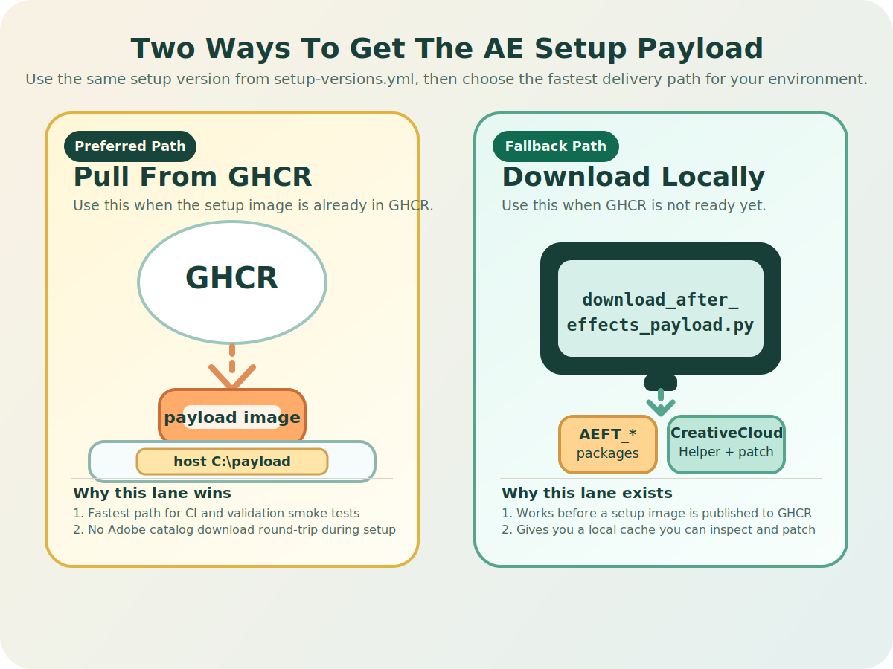

# After Effects Installer-Cache Setup In A Windows Container

This guide describes the validated installer-cache workflow for deploying the setup version selected in `setup-versions.yml` inside a Shotwright container.

Shotwright supports two runtime modes:

1. **Host mount** — mount the host-side After Effects install that matches the version selected in `setup-versions.yml` into the container.
2. **Installer-cache mode** — pull the prepared setup image from GHCR first, or build the cache locally as a fallback, then let Shotwright install After Effects automatically at startup.

This document focuses on installer-cache mode.

## 1. Resolve and obtain the installer cache

Resolve the active setup version from `setup-versions.yml` first:

```powershell
$setup = python .\scripts\install\setup_versions.py | ConvertFrom-Json
```

This object also includes `$setup.install_root`, the AE install directory expected for the selected version.

Cross-environment defaults such as host payload roots, runner temp subdirectory names, container mount roots, and base image tags are centralized in [shotwright-config.json](shotwright-config.json).

<p align="center">
    
</p>

The recommended approach is to pull the pre-built installer payload image from GHCR:

```powershell
docker pull $setup.ghcr_image
docker create --name ae-setup $setup.ghcr_image cmd /c exit
docker cp 'ae-setup:C:\payload' 'C:\data\payload'
docker rm ae-setup
```

If the image is too large for a reliable `docker pull`, use `scripts/pull_container_image.py` instead. It downloads through `http_proxy` or `https_proxy`, writes a docker archive to disk, and can load it locally:

```powershell
python .\scripts\pull_container_image.py --image $setup.ghcr_image --output-dir C:\data\images --load
```

After extraction you should have:

| Directory | Required contents |
| --- | --- |
| `C:\data\payload\<payload_dir_name>` | `driver.xml` and all AE package folders |
| `C:\data\payload\<helper_dir_name>` | `HDBox` (with patched `Setup.exe`) and `IPC` directories |

<details>
<summary><strong>Alternative: build the installer cache from scratch</strong></summary>

If you need to build the installer cache locally instead of pulling from GHCR:

```powershell
python scripts\install\download_after_effects_payload.py --payload-root C:\data\payload
```

That script relies on `scripts/install/download_utils.py` and the helper classes used to resolve Adobe packages and supporting downloads.

Before first use, patch the helper installer:

```powershell
$helperSetup = Join-Path (Join-Path 'C:\data\payload' $setup.helper_dir_name) 'HDBox\Setup.exe'
python scripts\install\modify_setup_win.py $helperSetup
```

If the file has already been patched, the script reports `Setup.exe appears to be already patched.` and exits successfully.

</details>

## 2. Prerequisites

1. Docker Desktop is running in Windows container mode. `docker info --format '{{.OSType}}'` should return `windows`.
2. You have already built, or are ready to build, a local Shotwright image.

## 3. Build the Shotwright image

```powershell
docker build -t shotwright:runtime .
```

The Dockerfile now builds the all-in-one `shotwright:runtime` image. It copies the published After Effects setup payload from GHCR into the image and runs the installer during image build, so service-created worker containers do not depend on runtime payload mounts.

## 4. Run the end-to-end install and validation flow

Use `scripts/validate/run_validation.ps1`:

```powershell
powershell -ExecutionPolicy Bypass -File .\scripts\validate\run_validation.ps1 `
    -ImageTag shotwright:runtime `
    -AfterEffectsPayloadRoot (Join-Path 'C:\data\payload' $setup.payload_dir_name) `
    -CreativeCloudHelperRoot (Join-Path 'C:\data\payload' $setup.helper_dir_name)
```

This command does the following:

1. Starts a Windows container from the specified image.
2. Mounts the repository, validation data directory, AE installer cache, and Creative Cloud helper cache.
3. Lets `scripts/runtime_entrypoint.ps1` invoke `scripts/install/install_after_effects_in_container.ps1`.
4. Waits for `aerender.exe` to appear and report a version.
5. Generates `validation_motion.aep`.
6. Runs nexrender and ensures `validation.mp4` ends up in `validation-data/output`.

Expected result:

```text
validation-data\output\validation.mp4
```

## 5. Known issues

### Validation succeeds but nexrender exits non-zero

After Effects sometimes returns a non-zero exit code even when the render completed successfully. When that happens, `scripts/validate/run_validation.ps1` recovers the newest `result.mp4` from `validation-data/work`.

### `Invalid driverXML ... parameter specified`

This usually means the `driver.xml` path was split by spaces. Use space-free paths such as `C:\data\payload\<payload_dir_name>`.

### `Path:C:\adobeTemp already exists`

This message is non-fatal. The installer is reusing a temporary extraction directory and can continue.

## 6. Acceptance criteria

1. The install completes without `Adobe Setup is not Authorized`.
2. `$setup.install_root\Support Files\aerender.exe` exists inside the container.
3. `aerender -version` prints a valid version string.
4. `validation.mp4` is produced under `validation-data/output`.
